# 技术栈

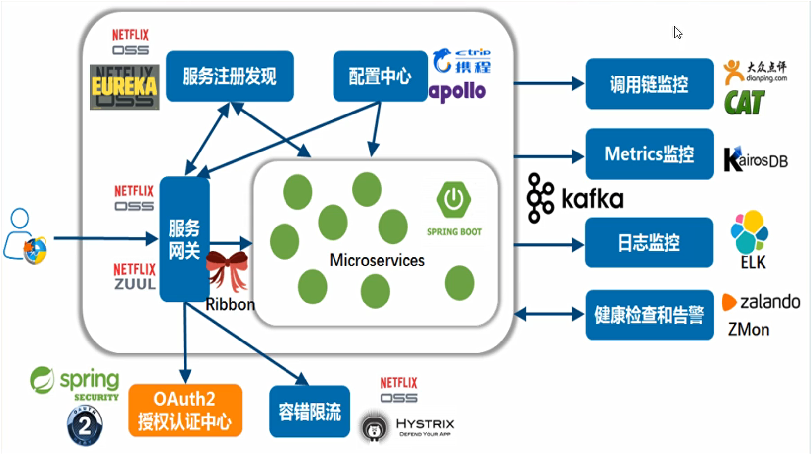

主流的架构:

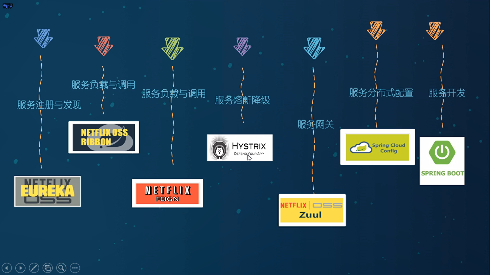

学习知识点总线:

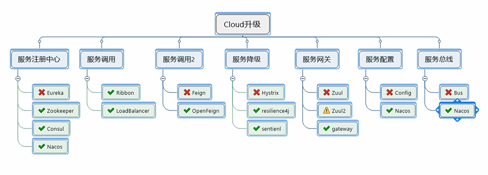

## 热部署

1. 引入依赖

```properties
1.  子工程pom
 <dependency>
            <groupId>org.springframework.boot</groupId>
            <artifactId>spring-boot-devtools</artifactId>
            <scope>runtime</scope>
            <optional>true</optional>
 </dependency>
        
        
2. 父工程pom

  <build>
    <plugins>
      <plugin>
        <groupId>org.springframework.boot</groupId>
        <artifactId>spring-boot-maven-plugin</artifactId>
        <configuration>
          <fork>true</fork>
          <addResources>true</addResources>
        </configuration>
      </plugin>
    </plugins>
  </build>
        
```

2. idea开启这个设置

   

3. idea注册热部署(快捷键: ctrl+shift+alt+/, 选择registry), 把下面两个的勾勾打上, 然后重启idea(到这里热部署成功了, 修改之后保存自动重启或者一两秒之后自动重启了)

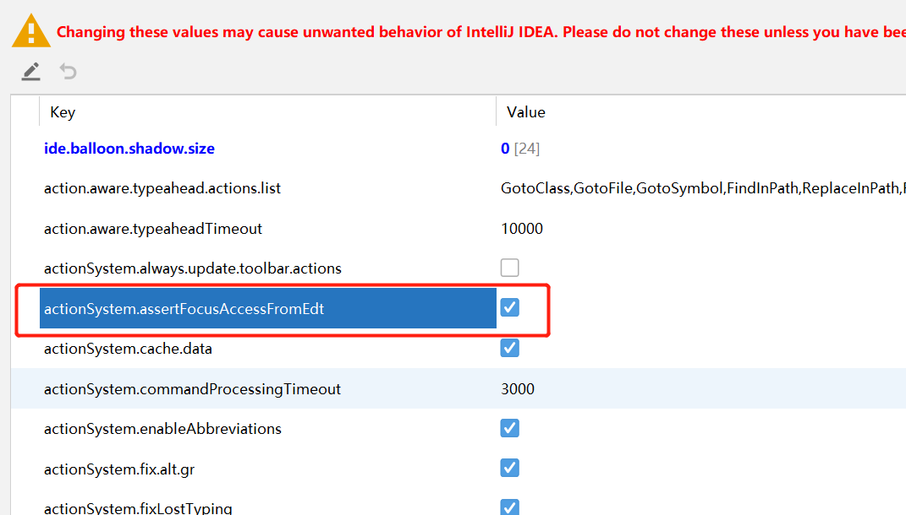


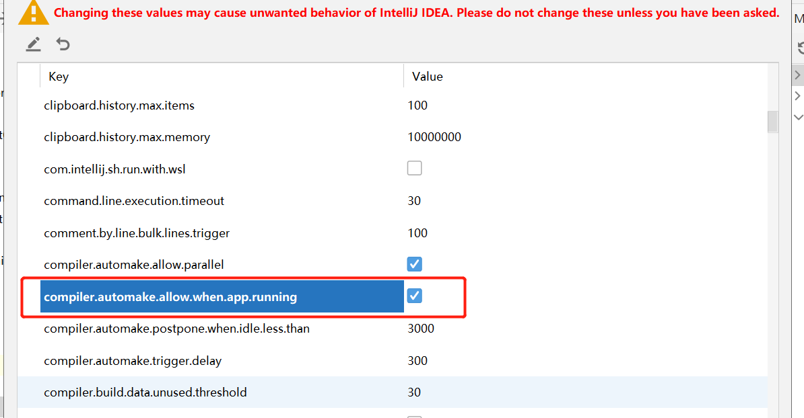


## RestTemplate

用来远程访问服务的工具集

使用:

(url, requestMap, ResponseBean.class)这三个参数代表rest的请求地址, 请求参数, http响应转换被转换成的对象类型


## 工程重构

将公共的类抽取出来供其他模块使用

1. 新建一个模块专门用来存放公共的类
2. 在这个模块中的maven先clean再install进本地仓库
3. 在其他模块中的pom使用(dependency中写公共模块的gav)

例如:

被安装到本地仓库的模块pom:

```xml
  <parent>
        <artifactId>cloud2020</artifactId>
        <groupId>com.atguigu</groupId>
        <version>1.0-SNAPSHOT</version>
    </parent>
    <modelVersion>4.0.0</modelVersion>

    <artifactId>cloud-api-commons</artifactId>

```

在其他模块引用:

```xml
  <!--引入自定义的api通用包, 可以使用payment支持Entity-->
        <dependency>
            <groupId>com.atguigu</groupId>
            <artifactId>cloud-api-commons</artifactId>
            //跟本工程的version相同可以这样取值(取本工程的version)
            <version>${project.version}</version>
        </dependency>
```


## 服务注册中心

### RestTemplate

服务的调用使用RestTemplate, 它里面getForObject和getForEntity的区别:

1. getForObject: 返回对象为相应体重数据转化成的对象, 基本上可以理解成Json
2. getForEntity:  返回对象为ResponsEntity对象, 包含了响应体中一些重要信息, 比如响应头, 响应状态码, 响应体等等


Eureka架构图:

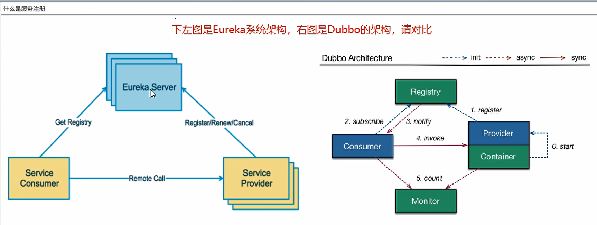

### Eureka

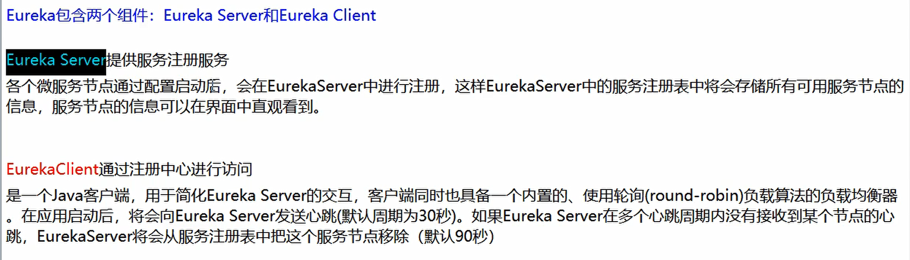

使用:

#### 服务端配置(Eureka自己的模块)

**==eureka不用下载客户端(以jar包的方式引入工程), 所以需要一个模块(Eureka的服务端)来作为自己的配置, 而zookeeper要下载, 下载的zookeeper可以直接作为服务端使用, 所以不需要独立模块作为配置==**

1. 引入(server依赖)

   ```xml
   <dependency>
               <groupId>org.springframework.cloud</groupId>
               <artifactId>spring-cloud-starter-netflix-eureka-server</artifactId>
   </dependency>
   ```

2. 配置yml

```properties
server:
  port: 7001

eureka:
  instance:
    hostname: localhost  #eureka服务端的实例名字, 多个服务提供者的名字可以一样
  client:
    #表示不向注册中心注册自己
    register-with-eureka: false
    #表示自己就是注册中心，职责是维护服务实例，并不需要去检索服务
    fetch-registry: false
    service-url:
      #设置与eureka server交互的地址查询服务和注册服务都需要依赖这个地址
      defaultZone: http://${eureka.instance.hostname}:${server.port}/eureka/


```

3. 在启动类添加注解

```java
@SpringBootApplication
//注册Eureka的注册服务中心
@EnableEurekaServer
public class EurekaMain7001 {
    public static void main(String[] args) {
        SpringApplication.run(EurekaMain7001.class, args);
    }
}

```


#### 客户端配置

##### 服务提供者模块

新建一个模块后在模块中配置:

1. 引入Eureka的客户端依赖

```xml

        <!-- https://mvnrepository.com/artifact/org.springframework.cloud/spring-cloud-starter-eureka-server -->
        <dependency>
            <groupId>org.springframework.cloud</groupId>
            <artifactId>spring-cloud-starter-netflix-eureka-client</artifactId>
        </dependency>

```

2. 修改yml

```properties
spring:
  application:
	# 入住到Eureka服务器的应用名称
    name: cloud-payment-service

eureka:
  client:
    #表示是否将自己注册进EurekaServer, 默认为true
    register-with-eureka: true
    #是否从EurekaServer抓取已有的注册信息, 默认为true. 单节点无所谓, 集群必须设置为true才能配合ribbon使用负载均衡
    fetchRegistry: true
    service-url:
      defaultZone: http://localhost:7001/eureka #可以注册多个集群, 多个集群使用,隔开


```

3. 开启Eureka的客户端注解

```java
@SpringBootApplication
@EnableEurekaClient
public class PaymentMain8001 {
    public static void main(String[] args) {
        SpringApplication.run(PaymentMain8001.class, args);
    }
}
```

4. 启动测试

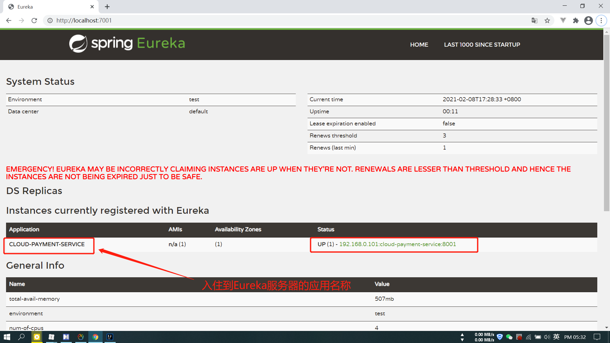


##### 服务消费者模块

1. 引入依赖

```xml
 <!-- https://mvnrepository.com/artifact/org.springframework.cloud/spring-cloud-starter-eureka-server -->
        <dependency>
            <groupId>org.springframework.cloud</groupId>
            <artifactId>spring-cloud-starter-netflix-eureka-client</artifactId>
        </dependency>

```

2. 改写pom

```properties
spring:
  application:
    name: cloud-order-service

eureka:
  client:
    #表示是否将自己注册进EurekaServer, 默认为true
    register-with-eureka: true
    #是否从EurekaServer抓取已有的注册信息, 默认为true. 单节点无所谓, 集群必须设置为true才能配合ribbon使用负载均衡
    fetchRegistry: true
    service-url:
      #我们自己配置的Eureka中心的地址
      defaultZone: http://localhost:7001/eureka  #可以注册多个集群, 多个集群使用,隔开


```

3. 主启动类开启Eureka客户端注解

```java
@SpringBootApplication
@EnableEurekaClient
public class OrderMain80 {
    public static void main(String[] args) {
        SpringApplication.run(OrderMain80.class, args);
    }

}
```


#### Eureka集群原理

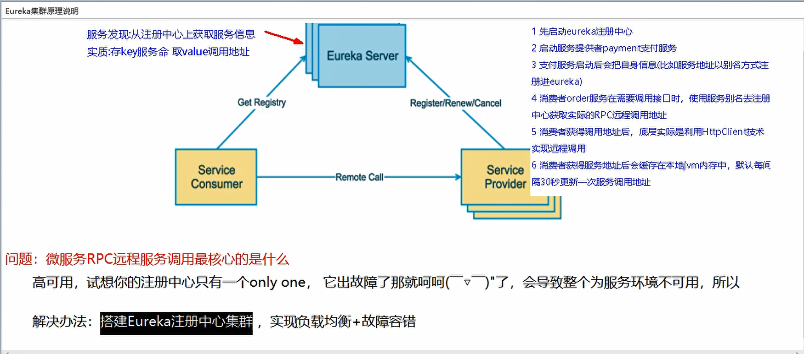

**==集群: 多个注册中心(Eureka)互相注册, 相互守望==**


#### Eureka集群的搭建

1. 在本机模拟搭建集群首先要设置host文件的映射(主机和域名的映射)

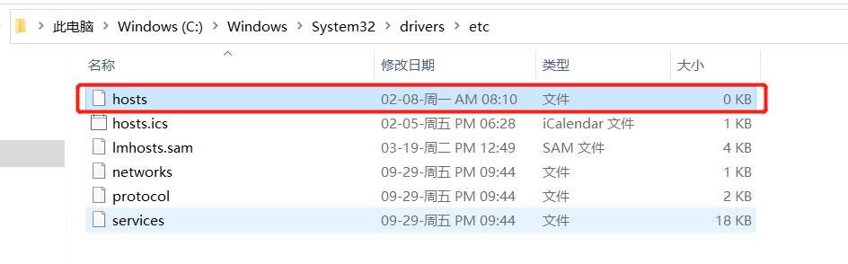

模拟两台机器, 使两个域名映射同一台机器(域名要跟yml中的eureka实例的主机名一致)

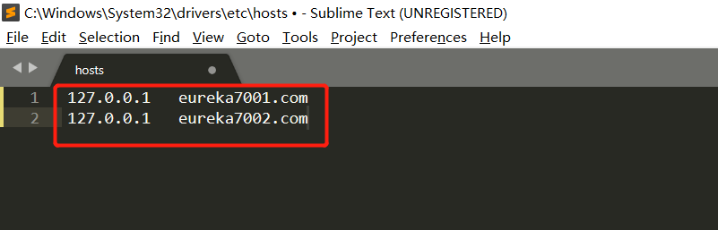

2. 两个Eureka服务之间相互调用, 相互守望

7001端口:

```properties
server:
  port: 7001

eureka:
  instance:
    hostname: eureka7001.com  #eureka服务端的实例名字
  client:
    #表示不向注册中心注册自己
    register-with-eureka: false
    #表示自己就是注册中心，职责是维护服务实例，并不需要去检索服务
    fetch-registry: false
    service-url:
      #设置与eureka server交互的地址查询服务和注册服务都需要依赖这个地址
      defaultZone: http://eureka7002.com:7002/eureka/ #注册另一个Eureka(7002端口的)形成集群


```

7002端口:

```properties
server:
  port: 7002

eureka:
  instance:
    hostname: eureka7002.com  #eureka服务端的实例名字
  client:
    #表示不向注册中心注册自己
    register-with-eureka: false
    #表示自己就是注册中心，职责是维护服务实例，并不需要去检索服务
    fetch-registry: false
    service-url:
      #设置与eureka server交互的地址查询服务和注册服务都需要依赖这个地址
      defaultZone: http://eureka7001.com:7001/eureka/ #注册另一个Eureka(7001端口的)形成集群

```

##### 测试

如果7001能够出现7002, 7002能够出现7001则说明集群搭建成功

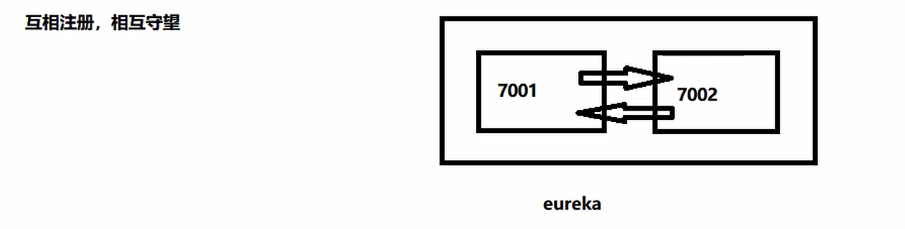

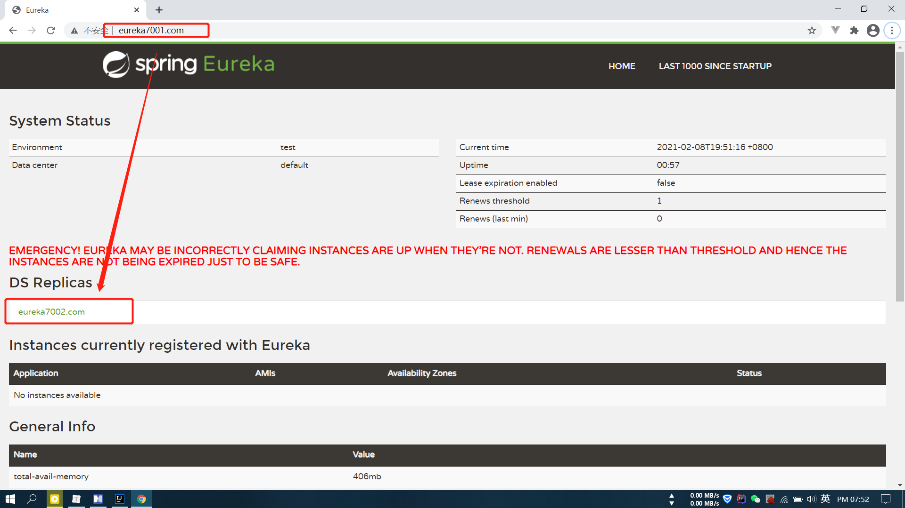


#### 消费者服务地址(应用名称)的配置

**==消费者要发现的服务地址不能写死, 要写Eureka向外暴露的服务名称(消费者只关心微服务的名称)==**


```java
public static final String PAYMENT_URL = "http://CLOUD-PAYMENT-SERVICE";
```

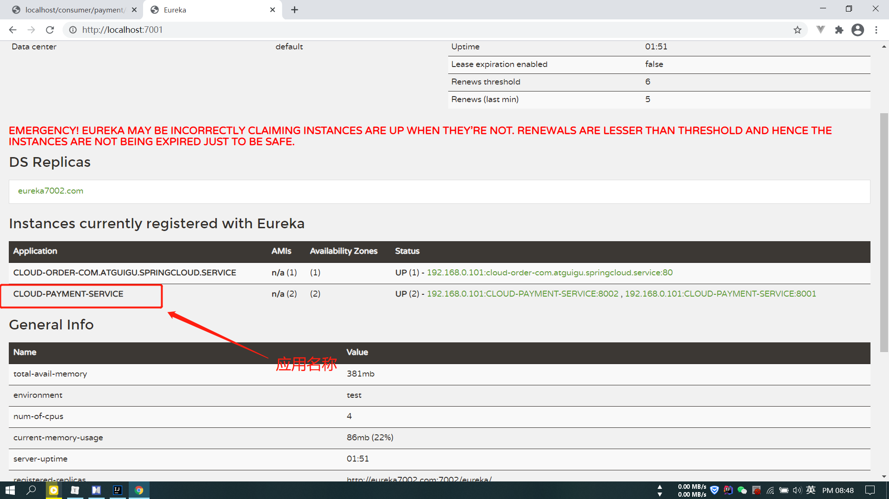

配置完成上述步骤后, 直接运行会报错:

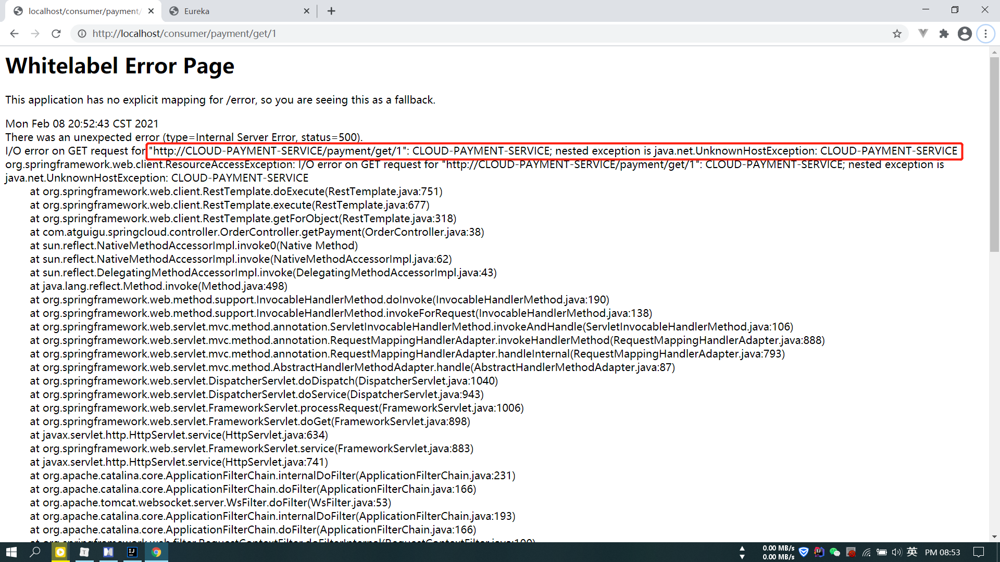

**==eureka不知道时=是哪一个主机, 消费者只指明了应用名称, 同一个应用可能会部署到多个主机上, 因此我们需要赋予RestTemplate负载均衡的能力(在RestTemplate的Bean上加上注解@LoadBalance)==**

```java
@Configuration
public class ApplicationContextConfig {

    @Bean
    @LoadBalanced
    public RestTemplate getRestTemplate(){
        return new RestTemplate();
    }
}
```

以上架构用一幅图来总结:

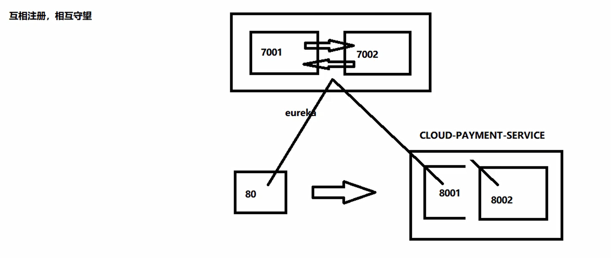

#### 修改Eureka的Status

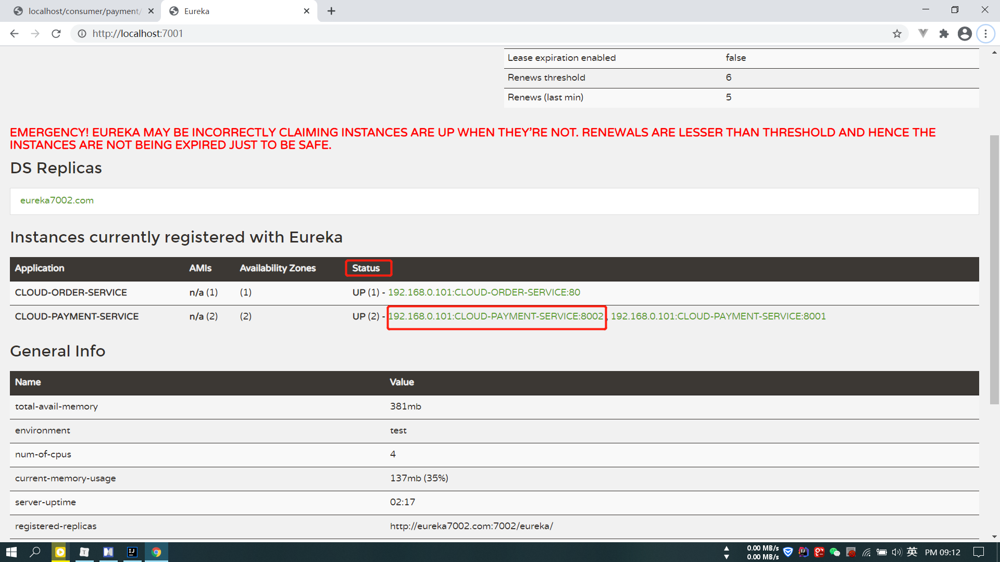

在yml中添加实例的配置即可

```properties
eureka.client.instance.instance-id: payment8001(或者xxx)
```

效果如图:

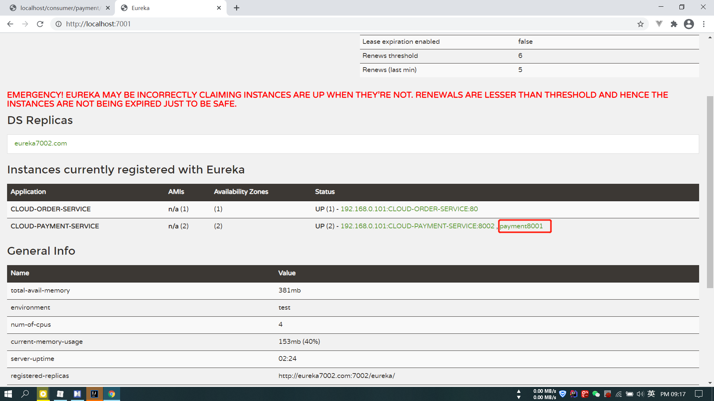


#### 配置访问Eureka的时候地址栏显示ip

```properties
eureka.client.instance.prefer-ip-address: true #访问路径可以显示ip
```

然后访问的时候就是这样的啦:

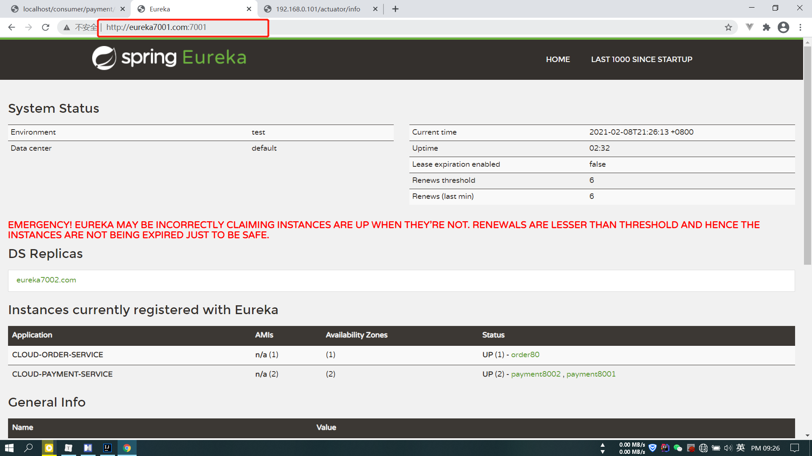


#### 服务发现

==**使用DiscoveryClient来进行微服务的发现**==

对于注册进Eureka里面的微服务, 可以通过服务发现来获得该服务的信息

1. 开启服务发现客户端

```java
@SpringBootApplication
@EnableDiscoveryClient
public class PaymentMain8001 {
    public static void main(String[] args) {
        SpringApplication.run(PaymentMain8001.class, args);
    }
}
```

2. 使用DiscoveryClient来发现服务

```java
//注意DiscoveryClient要是import org.springframework.cloud.client.discovery.DiscoveryClient;
@Resource
    private DiscoveryClient discoveryClient;

 @GetMapping("/payment/discovery")
    public Object discovery() {
        List<String> services = discoveryClient.getServices();
        services.forEach(log::info);
        List<ServiceInstance> instances = discoveryClient.getInstances("CLOUD-PAYMENT-SERVICE");
        instances.forEach(instance->log.info(instance.getServiceId()+"\t"+instance.getHost()+"\t"+instance.getPort()+"\t"+instance.getUri()));
        return this.discoveryClient;
    }
```

输出一下结果:

> ```java
> //服务ID:CLOUD-PAYMENT-SERVICE    主机:192.168.0.101   端口:8001    url:http://192.168.0.101:8001
> ```


#### Eureka的自我保护机制

自我保护机制就一句话:

> ==某一时刻的微服务不可用了, Eureka不会立即清理, 依旧会对该微服务的信息进行保存==

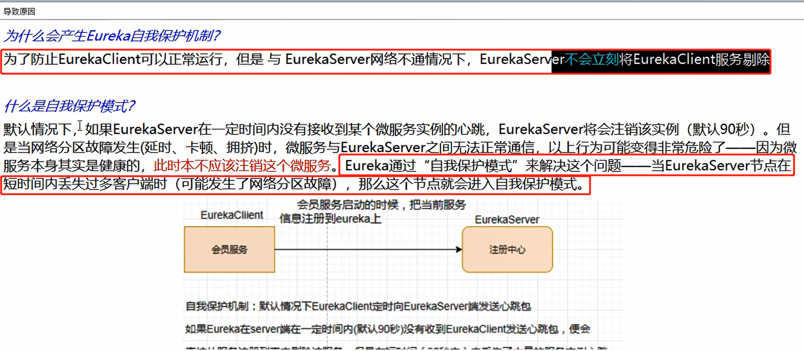

#### 关闭Eureka的自我保护机制

在Eureka服务端配置:

```properties
eureka:
    server:
        enable-self-preservation: false #关闭自我保护机制, 默认是true, 保证不可用的微服务即使被删除
```

要想在一定的时间范围内没有收到微服务的连接消息, 可以删除微服务(前提是关闭了自我保护机制):

```properties
eureka:
	server:
		eviction-interval-timer-in-ms: 2000 #超过两千毫秒还没有收到微服务的心跳则删除那个微服务
```

查看关闭自我保护机制是否成功, 成功如下:

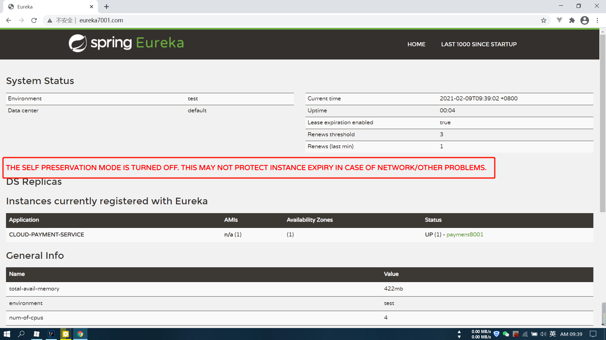

 Eureka客户端配置发送心跳的时间间隔:

```properties
eureka:
	instance:
		#Eureka客户端向服务端发送心跳的时间间隔, 单位为秒(默认是90秒), 超时本服务将被剔除
    	lease-renewal-interval-in-seconds: 1
    	#Eureka服务端在接收到最后一次心跳后等待时间上限, 单位为秒(默认是90秒), 超时本服务将被剔除
    	lease-expiration-duration-in-seconds: 2
```

总结上述配置:

	1. Eureka客户端每个1秒向服务端发送一次心跳
	2. Eureka服务端在两秒的时间间隔内没有收到客户端的心跳, 则再等2秒, 还是没有收到则剔除该客户端的微服务


### Zookeeper代替Eureka

zookeeper的服务节点时临时节点, 也就是说zookeeper默认不会对服务进行保留, 不像eureka有自我保护机制

zookeeper代替eureka非常的简单, 只需要在pom中注册即可,注册多个zk用逗号隔开, 然后就可以通过RestTemplate来进行远程的调用

1. 消费者注册zk:

```properties
server:
  port: 80

spring:
  application:
    name: cloud-consumer-order
  cloud:
    zookeeper:
      #注册到zookeeper地址
      connect-string: localhost:2181
```

2. 生产者注册zk:

```properties
server:
  port: 8004

spring:
  application:
    name: cloud-consumer-order
  cloud:
    zookeeper:
      #注册到zookeeper地址, 可以是多个, 用逗号隔开形成集群
      #注册了多个集群后, RestTemplate使用@Balance注解注入实现负载均衡
      connect-string: localhost:2181
```

3. 在消费者中使用RestTemplate进行消费:

```java
@RestController
public class OrderZKController {
    //cloud-provider-payment为应用名字
    public static final String INVOCK_URL = "http://cloud-provider-payment";

    @LoadBalanced
    @Resource
    private RestTemplate restTemplate;

    @GetMapping("/consumer/payment/zk")
    public String paymentInfo(){
        return restTemplate.getForObject(INVOCK_URL+"/payment/zk", String.class);
    }
}
```


### consul

是一套开源的分布式服务发现和配置管理系统, **==提供了微服务系统中的服务治理, 配置中心, 控制总线等功能.==**

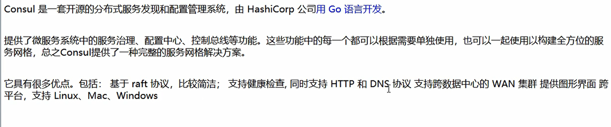

能干嘛?

1. 服务发现: 提供http和dns两种方式
2. 健康检测: 支持多种方式, http,tcp,docker,shell将本定制化
3. kv存储: key-value的存储方式
4. 多数据中心: consul支持多数据中心
5. 可视化web界面


#### 服务提供者注册进consul

1. 引入依赖

```xml
  <!-- https://mvnrepository.com/artifact/org.springframework.cloud/spring-cloud-starter-consul-discovery -->
        <dependency>
            <groupId>org.springframework.cloud</groupId>
            <artifactId>spring-cloud-starter-consul-discovery</artifactId>
        </dependency>

```

2. 开启服务发现

```java
@SpringBootApplication
@EnableDiscoveryClient
public class PaymentMain8006 {
    public static void main(String[] args) {
        SpringApplication.run(PaymentMain8006.class, args);
    }
}
```

3. 配置yml文件

```properties
server:
  port: 8006

spring:
  application:
    name: consul-provider-payment
  cloud:
    consul:
      host: localhost
      port: 8500
      discovery:
        service-name: ${spring.application.name}
```

4. 通过RestTemplate调用服务

```java
@RestController
@Slf4j
public class OrderConsulController {

    public static final String INVOK_URL = "http://consul-provider-payment";

    @Resource
    private RestTemplate restTemplate;

    @GetMapping("/consumer/payment/consul")
    public String paymentInfo(){
        return restTemplate.getForObject(INVOK_URL+"/payment/consul", String.class);
    }

}
```


### Eureka,zookeeper,consul总结

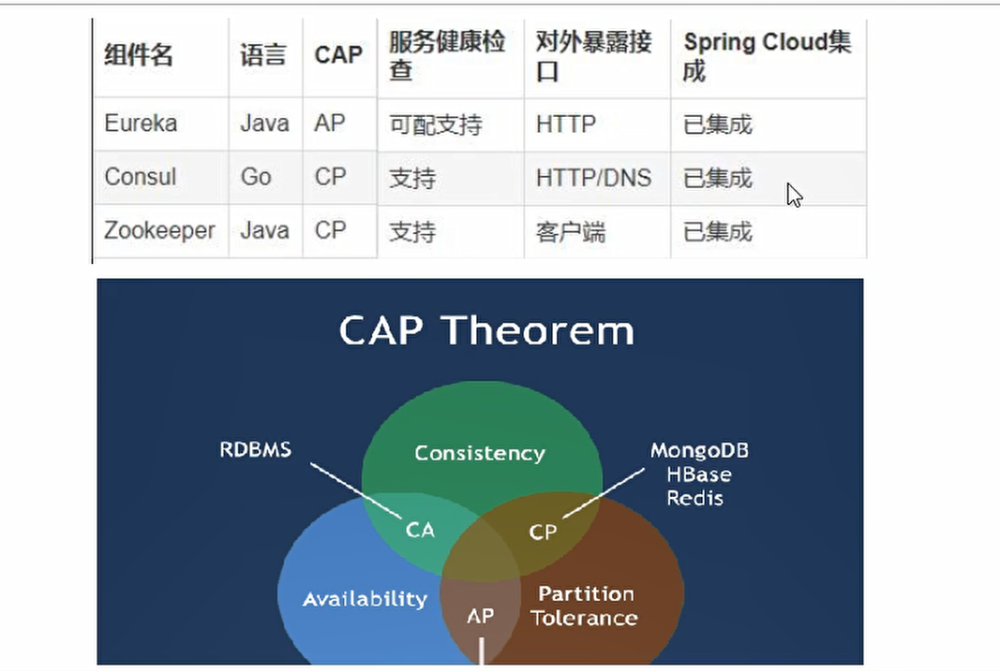

### ribbon

是一套客户端的负载均衡工具

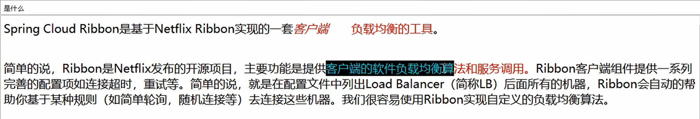

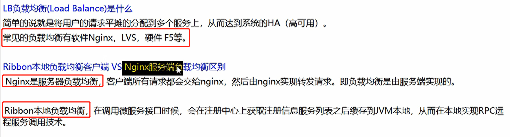


**集中式负载均衡(LB):**

> 即在服务的消费方和提供方之间使用独立的LB设施(可以是硬件, 如F5, 也可以是软件, 入nginx), 由该设施负责把访问请求通过某种策略转发至服务的提供方

**进程内负载均衡(LB):**

> 将负载均衡逻辑集成到消费方, 消费方从服务注册中心获知有哪些地址可用, 然后自己再从这些地址中选择出一个合适的服务器.Ribbon就属于进程内的LB, 它是一个类库, 继承消费方进程, 消费方通过它来获取到服务提供的地址

ribbon能干什么, 总结起来就是一句话:  负载均衡 + RestTemplate调用


ribbon架构原理图:

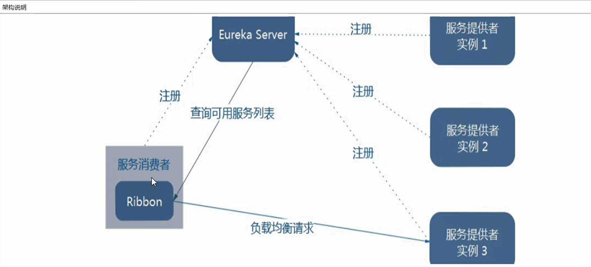

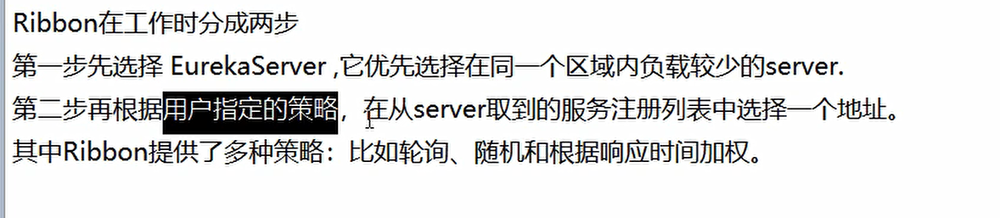

ribbon默认自带的负载均衡规则由以下其中:

1. ==**com.netflix.loadbalancer.RoundRibbonRule: 轮询(默认使用)**==
2. ==**com.netflix.loadbalancer.RandomRule: 随机**==
3. ==**com.netflix.loadbalancer.RetryRule: 先按照RoundRibbonRule的策略获取服务, 如果获取服务失败则在指定时间内会进行重试**==
4. ==**com.netflix.loadbalancer.WeihtedResponseTimeRule: 对RoundRibbonRule的扩展, 响应速度越快的实例选择权重越大, 越容易被选择**==
5. ==**com.netflix.loadbalancer.BestAvailableRule: 会过滤掉由于多次访问故障而处于断路器跳闸状态的服务, 然后选择一个并发量最小的服务**==
6. ==**com.netflix.loadbalancer.AvailabilityFilteringRule: 先过滤掉实例故障, 再选择并发较小的实例**==
7. ==**com.netflix.loadbalancer.ZoneAvoidanceRule: 符合判断server所在区域的性能和server的可用性选择服务器**==


#### 如何更换负载均衡规则

1. **往容器中添加响应的配置类**, 但是这个自定义的配置类**==不能放在@ComponentScan所扫描的当前包下以及子包下==**, 否则我们自定义的这个配置类就会被所有的Ribbon客户端所共享, 达不到特殊化定制的目了.
2. 

