# 技术栈

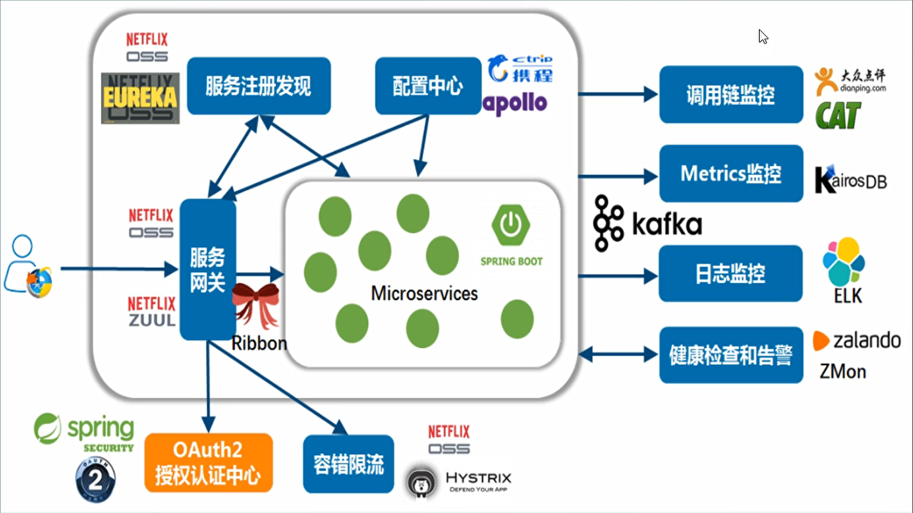

主流的架构:


## 学习知识点总线:


## 热部署

1. 引入依赖

```properties
1.  子工程pom
 <dependency>
            <groupId>org.springframework.boot</groupId>
            <artifactId>spring-boot-devtools</artifactId>
            <scope>runtime</scope>
            <optional>true</optional>
 </dependency>
        
        
2. 父工程pom

  <build>
    <plugins>
      <plugin>
        <groupId>org.springframework.boot</groupId>
        <artifactId>spring-boot-maven-plugin</artifactId>
        <configuration>
          <fork>true</fork>
          <addResources>true</addResources>
        </configuration>
      </plugin>
    </plugins>
  </build>
        
```

2. idea开启这个设置

   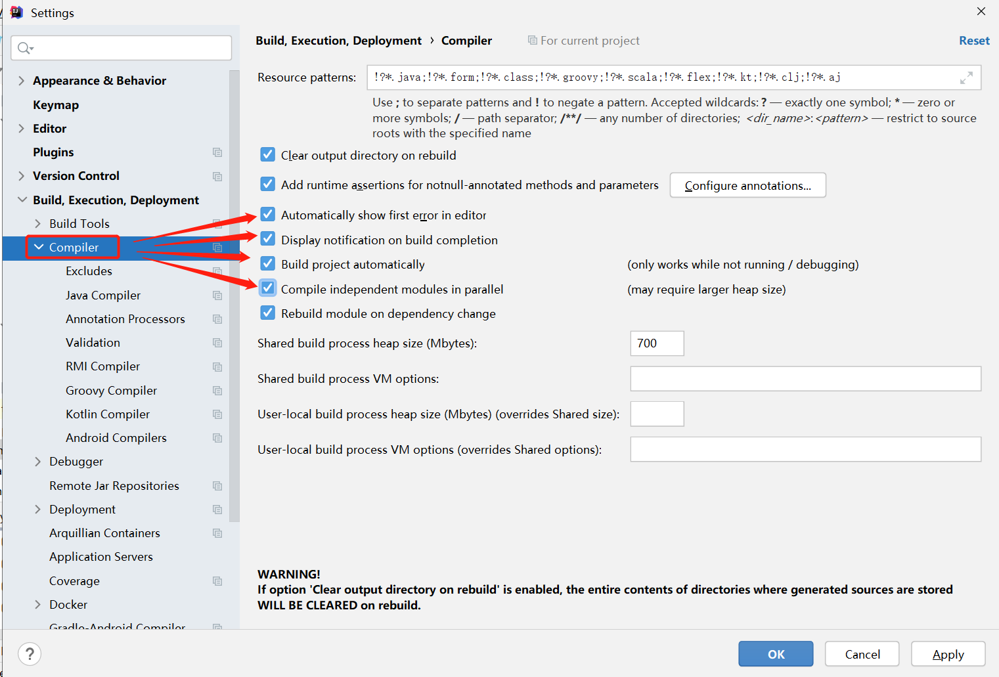

3. idea注册热部署(快捷键: ctrl+shift+alt+/, 选择registry), 把下面两个的勾勾打上, 然后重启idea(到这里热部署成功了, 修改之后保存自动重启或者一两秒之后自动重启了)


## RestTemplate

用来远程访问服务的工具集

使用:

(url, requestMap, ResponseBean.class)这三个参数代表rest的请求地址, 请求参数, http响应转换被转换成的对象类型


## 工程重构

将公共的类抽取出来供其他模块使用

1. 新建一个模块专门用来存放公共的类
2. **==在这个模块中的maven先clean再install进本地仓库(如果报这个依赖的错, 那就install跟模块进去)==**
3. 在其他模块中的pom使用(dependency中写公共模块的gav)

例如:

被安装到本地仓库的模块pom:

```xml
  <parent>
        <artifactId>cloud2020</artifactId>
        <groupId>com.atguigu</groupId>
        <version>1.0-SNAPSHOT</version>
    </parent>
    <modelVersion>4.0.0</modelVersion>

    <artifactId>cloud-api-commons</artifactId>

```

在其他模块引用:

```xml
  <!--引入自定义的api通用包, 可以使用payment支持Entity-->
        <dependency>
            <groupId>com.atguigu</groupId>
            <artifactId>cloud-api-commons</artifactId>
            //跟本工程的version相同可以这样取值(取本工程的version)
            <version>${project.version}</version>
        </dependency>
```


## 服务注册中心

### RestTemplate

服务的调用使用RestTemplate, 它里面getForObject和getForEntity的区别:

1. getForObject: 返回对象为相应体重数据转化成的对象, 基本上可以理解成Json
2. getForEntity:  返回对象为ResponsEntity对象, 包含了响应体中一些重要信息, 比如响应头, 响应状态码, 响应体等等


Eureka架构图:


### Eureka


使用:

#### 服务端配置(Eureka自己的模块)

**==eureka不用下载客户端(以jar包的方式引入工程), 所以需要一个模块(Eureka的服务端)来作为自己的配置, 而zookeeper要下载, 下载的zookeeper可以直接作为服务端使用, 所以不需要独立模块作为配置==**

1. 引入(server依赖)

   ```xml
   <dependency>
               <groupId>org.springframework.cloud</groupId>
               <artifactId>spring-cloud-starter-netflix-eureka-server</artifactId>
   </dependency>
   ```

2. 配置yml

```properties
server:
  port: 7001

eureka:
  instance:
    hostname: localhost  #eureka服务端的实例名字, 多个服务提供者的名字可以一样
  client:
    #表示不向注册中心注册自己
    register-with-eureka: false
    #表示自己就是注册中心，职责是维护服务实例，并不需要去检索服务
    fetch-registry: false
    service-url:
      #设置与eureka server交互的地址查询服务和注册服务都需要依赖这个地址
      defaultZone: http://${eureka.instance.hostname}:${server.port}/eureka/


```

3. 在启动类添加注解

```java
@SpringBootApplication
//注册Eureka的注册服务中心
@EnableEurekaServer
public class EurekaMain7001 {
    public static void main(String[] args) {
        SpringApplication.run(EurekaMain7001.class, args);
    }
}

```


#### 客户端配置

##### 服务提供者模块

新建一个模块后在模块中配置:

1. 引入Eureka的客户端依赖

```xml

        <!-- https://mvnrepository.com/artifact/org.springframework.cloud/spring-cloud-starter-eureka-server -->
        <dependency>
            <groupId>org.springframework.cloud</groupId>
            <artifactId>spring-cloud-starter-netflix-eureka-client</artifactId>
        </dependency>

```

2. 修改yml

```properties
spring:
  application:
	# 入住到Eureka服务器的应用名称
    name: cloud-payment-service

eureka:
  client:
    #表示是否将自己注册进EurekaServer, 默认为true
    register-with-eureka: true
    #是否从EurekaServer抓取已有的注册信息, 默认为true. 单节点无所谓, 集群必须设置为true才能配合ribbon使用负载均衡
    fetchRegistry: true
    service-url:
      defaultZone: http://localhost:7001/eureka #可以注册多个集群, 多个集群使用,隔开


```

3. 开启Eureka的客户端注解

```java
@SpringBootApplication
@EnableEurekaClient
public class PaymentMain8001 {
    public static void main(String[] args) {
        SpringApplication.run(PaymentMain8001.class, args);
    }
}
```

4. 启动测试

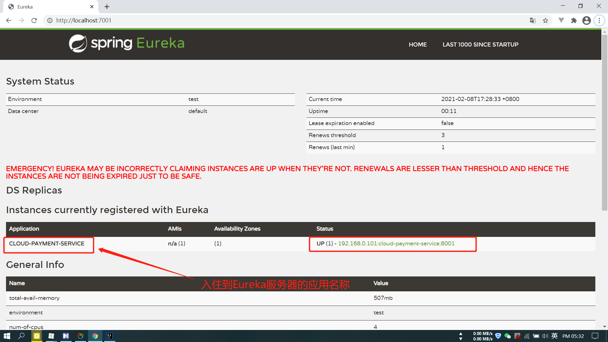


##### 服务消费者模块

1. 引入依赖

```xml
 <!-- https://mvnrepository.com/artifact/org.springframework.cloud/spring-cloud-starter-eureka-server -->
        <dependency>
            <groupId>org.springframework.cloud</groupId>
            <artifactId>spring-cloud-starter-netflix-eureka-client</artifactId>
        </dependency>

```

2. 改写pom

```properties
spring:
  application:
    name: cloud-order-service

eureka:
  client:
    #表示是否将自己注册进EurekaServer, 默认为true
    register-with-eureka: true
    #是否从EurekaServer抓取已有的注册信息, 默认为true. 单节点无所谓, 集群必须设置为true才能配合ribbon使用负载均衡
    fetchRegistry: true
    service-url:
      #我们自己配置的Eureka中心的地址
      defaultZone: http://localhost:7001/eureka  #可以注册多个集群, 多个集群使用,隔开


```

3. 主启动类开启Eureka客户端注解

```java
@SpringBootApplication
@EnableEurekaClient
public class OrderMain80 {
    public static void main(String[] args) {
        SpringApplication.run(OrderMain80.class, args);
    }

}
```


#### Eureka集群原理

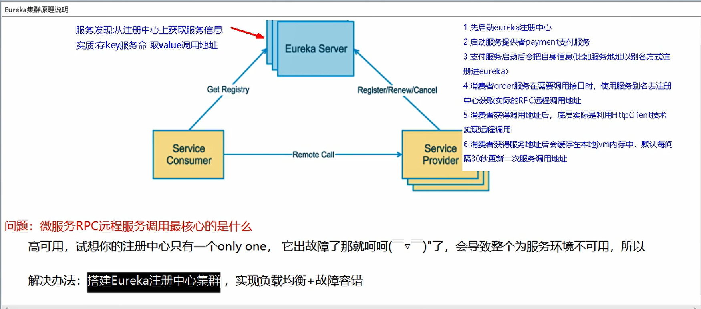

**==集群: 多个注册中心(Eureka)互相注册, 相互守望==**


#### Eureka集群的搭建

1. 在本机模拟搭建集群首先要设置host文件的映射(主机和域名的映射)

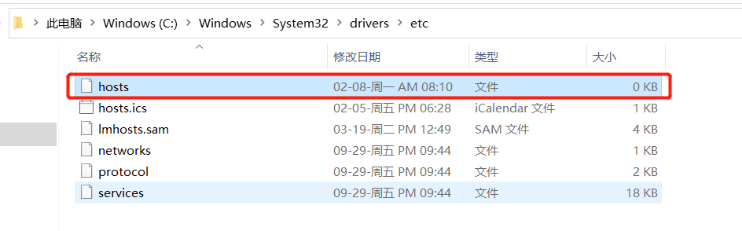

模拟两台机器, 使两个域名映射同一台机器(域名要跟yml中的eureka实例的主机名一致)


2. 两个Eureka服务之间相互调用, 相互守望

7001端口:

```properties
server:
  port: 7001

eureka:
  instance:
    hostname: eureka7001.com  #eureka服务端的实例名字
  client:
    #表示不向注册中心注册自己
    register-with-eureka: false
    #表示自己就是注册中心，职责是维护服务实例，并不需要去检索服务
    fetch-registry: false
    service-url:
      #设置与eureka server交互的地址查询服务和注册服务都需要依赖这个地址
      defaultZone: http://eureka7002.com:7002/eureka/ #注册另一个Eureka(7002端口的)形成集群


```

7002端口:

```properties
server:
  port: 7002

eureka:
  instance:
    hostname: eureka7002.com  #eureka服务端的实例名字
  client:
    #表示不向注册中心注册自己
    register-with-eureka: false
    #表示自己就是注册中心，职责是维护服务实例，并不需要去检索服务
    fetch-registry: false
    service-url:
      #设置与eureka server交互的地址查询服务和注册服务都需要依赖这个地址
      defaultZone: http://eureka7001.com:7001/eureka/ #注册另一个Eureka(7001端口的)形成集群

```

##### 测试

如果7001能够出现7002, 7002能够出现7001则说明集群搭建成功


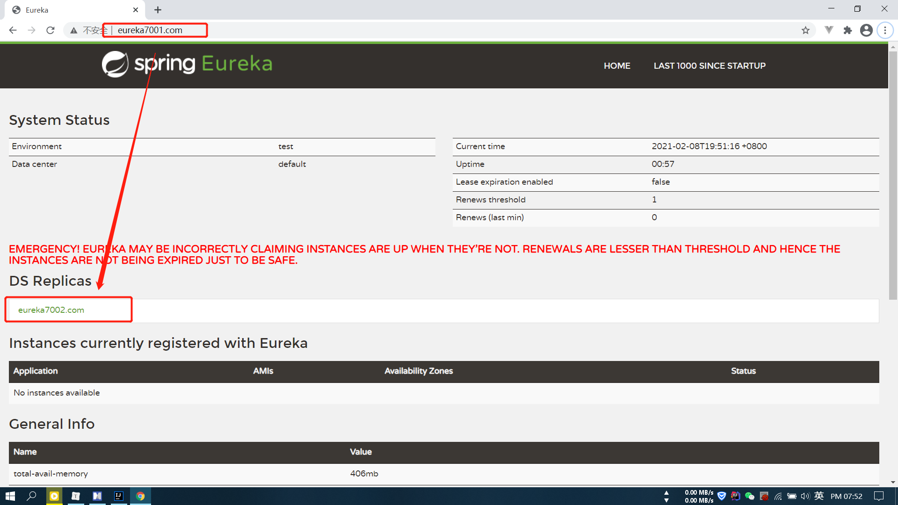

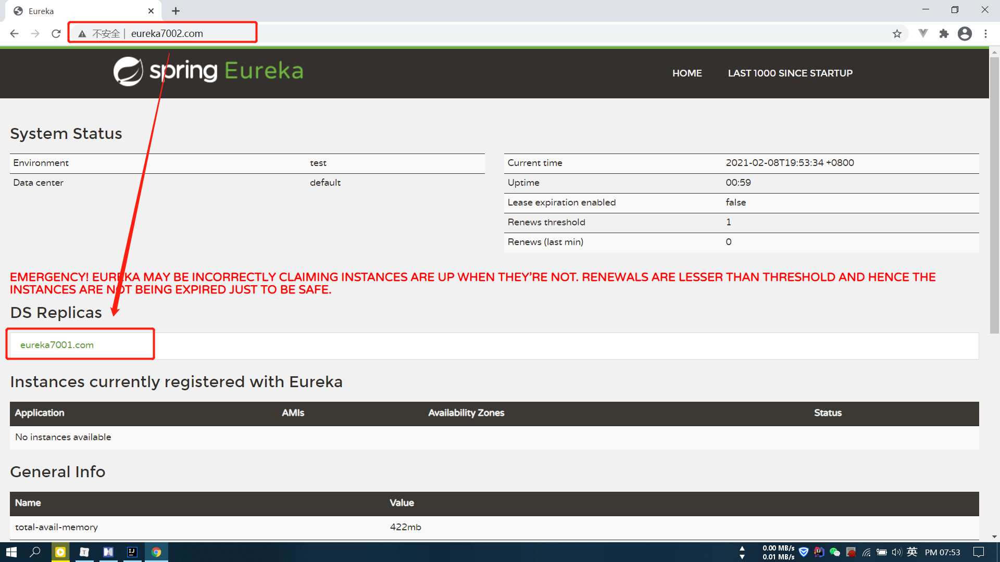


#### 消费者服务地址(应用名称)的配置

**==消费者要发现的服务地址不能写死, 要写Eureka向外暴露的服务名称(消费者只关心微服务的名称)==**


```java
public static final String PAYMENT_URL = "http://CLOUD-PAYMENT-SERVICE";
```


配置完成上述步骤后, 直接运行会报错:


**==eureka不知道时=是哪一个主机, 消费者只指明了应用名称, 同一个应用可能会部署到多个主机上, 因此我们需要赋予RestTemplate负载均衡的能力(在RestTemplate的Bean上加上注解@LoadBalance)==**

```java
@Configuration
public class ApplicationContextConfig {

    @Bean
    @LoadBalanced
    public RestTemplate getRestTemplate(){
        return new RestTemplate();
    }
}
```

以上架构用一幅图来总结:

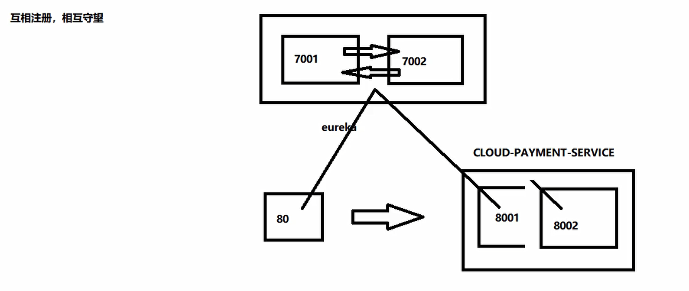

#### 修改Eureka的Status


在yml中添加实例的配置即可

```properties
eureka.client.instance.instance-id: payment8001(或者xxx)
```

效果如图:


#### 配置访问Eureka的时候地址栏显示ip

```properties
eureka.client.instance.prefer-ip-address: true #访问路径可以显示ip
```

然后访问的时候就是这样的啦:

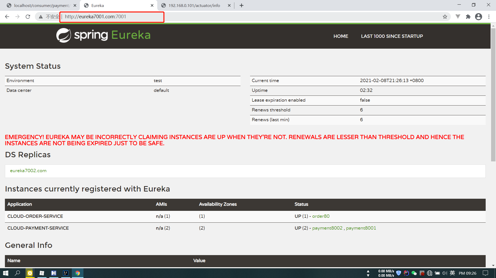


#### 服务发现

==**使用DiscoveryClient来进行微服务的发现**==

对于注册进Eureka里面的微服务, 可以通过服务发现来获得该服务的信息

1. 开启服务发现客户端

```java
@SpringBootApplication
@EnableDiscoveryClient
public class PaymentMain8001 {
    public static void main(String[] args) {
        SpringApplication.run(PaymentMain8001.class, args);
    }
}
```

2. 使用DiscoveryClient来发现服务

```java
//注意DiscoveryClient要是import org.springframework.cloud.client.discovery.DiscoveryClient;
@Resource
    private DiscoveryClient discoveryClient;

 @GetMapping("/payment/discovery")
    public Object discovery() {
        List<String> services = discoveryClient.getServices();
        services.forEach(log::info);
        List<ServiceInstance> instances = discoveryClient.getInstances("CLOUD-PAYMENT-SERVICE");
        instances.forEach(instance->log.info(instance.getServiceId()+"\t"+instance.getHost()+"\t"+instance.getPort()+"\t"+instance.getUri()));
        return this.discoveryClient;
    }
```

输出一下结果:

> ```java
> //服务ID:CLOUD-PAYMENT-SERVICE    主机:192.168.0.101   端口:8001    url:http://192.168.0.101:8001
> ```


#### Eureka的自我保护机制

自我保护机制就一句话:

> ==某一时刻的微服务不可用了, Eureka不会立即清理, 依旧会对该微服务的信息进行保存==


#### 关闭Eureka的自我保护机制

在Eureka服务端配置:

```properties
eureka:
    server:
        enable-self-preservation: false #关闭自我保护机制, 默认是true, 保证不可用的微服务即使被删除
```

要想在一定的时间范围内没有收到微服务的连接消息, 可以删除微服务(前提是关闭了自我保护机制):

```properties
eureka:
	server:
		eviction-interval-timer-in-ms: 2000 #超过两千毫秒还没有收到微服务的心跳则删除那个微服务
```

查看关闭自我保护机制是否成功, 成功如下:

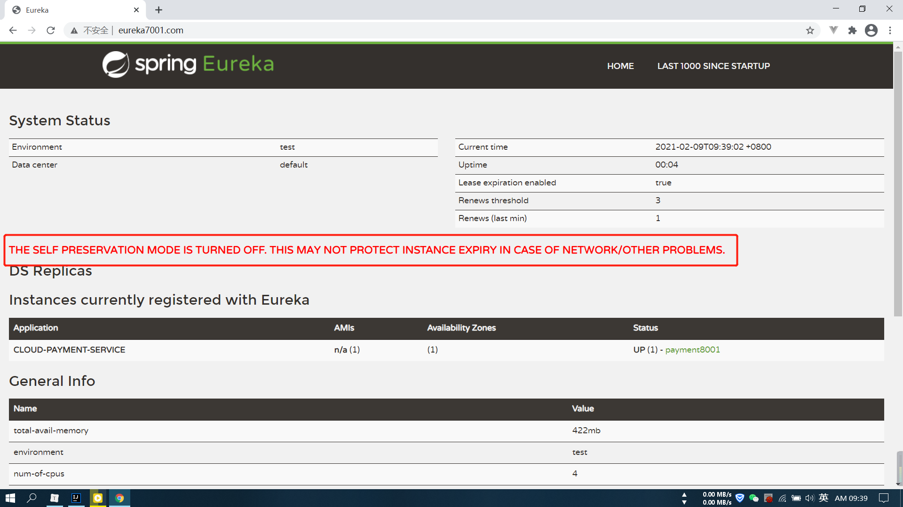

 Eureka客户端配置发送心跳的时间间隔:

```properties
eureka:
	instance:
		#Eureka客户端向服务端发送心跳的时间间隔, 单位为秒(默认是90秒), 超时本服务将被剔除
    	lease-renewal-interval-in-seconds: 1
    	#Eureka服务端在接收到最后一次心跳后等待时间上限, 单位为秒(默认是90秒), 超时本服务将被剔除
    	lease-expiration-duration-in-seconds: 2
```

总结上述配置:

	1. Eureka客户端每个1秒向服务端发送一次心跳
	2. Eureka服务端在两秒的时间间隔内没有收到客户端的心跳, 则再等2秒, 还是没有收到则剔除该客户端的微服务


### Zookeeper代替Eureka

zookeeper的服务节点时临时节点, 也就是说zookeeper默认不会对服务进行保留, 不像eureka有自我保护机制

zookeeper代替eureka非常的简单, 只需要在pom中注册即可,注册多个zk用逗号隔开, 然后就可以通过RestTemplate来进行远程的调用

1. 消费者注册zk:

```properties
server:
  port: 80

spring:
  application:
    name: cloud-consumer-order
  cloud:
    zookeeper:
      #注册到zookeeper地址
      connect-string: localhost:2181
```

2. 生产者注册zk:

```properties
server:
  port: 8004

spring:
  application:
    name: cloud-consumer-order
  cloud:
    zookeeper:
      #注册到zookeeper地址, 可以是多个, 用逗号隔开形成集群
      #注册了多个集群后, RestTemplate使用@Balance注解注入实现负载均衡
      connect-string: localhost:2181
```

3. 在消费者中使用RestTemplate进行消费:

```java
@RestController
public class OrderZKController {
    //cloud-provider-payment为应用名字
    public static final String INVOCK_URL = "http://cloud-provider-payment";

    @LoadBalanced
    @Resource
    private RestTemplate restTemplate;

    @GetMapping("/consumer/payment/zk")
    public String paymentInfo(){
        return restTemplate.getForObject(INVOCK_URL+"/payment/zk", String.class);
    }
}
```


### consul

是一套开源的分布式服务发现和配置管理系统, **==提供了微服务系统中的服务治理, 配置中心, 控制总线等功能.==**


能干嘛?

1. 服务发现: 提供http和dns两种方式
2. 健康检测: 支持多种方式, http,tcp,docker,shell将本定制化
3. kv存储: key-value的存储方式
4. 多数据中心: consul支持多数据中心
5. 可视化web界面


#### 服务提供者注册进consul

1. 引入依赖

```xml
  <!-- https://mvnrepository.com/artifact/org.springframework.cloud/spring-cloud-starter-consul-discovery -->
        <dependency>
            <groupId>org.springframework.cloud</groupId>
            <artifactId>spring-cloud-starter-consul-discovery</artifactId>
        </dependency>

```

2. 开启服务发现

```java
@SpringBootApplication
@EnableDiscoveryClient
public class PaymentMain8006 {
    public static void main(String[] args) {
        SpringApplication.run(PaymentMain8006.class, args);
    }
}
```

3. 配置yml文件

```properties
server:
  port: 8006

spring:
  application:
    name: consul-provider-payment
  cloud:
    consul:
      host: localhost
      port: 8500
      discovery:
        service-name: ${spring.application.name}
```

4. 通过RestTemplate调用服务

```java
@RestController
@Slf4j
public class OrderConsulController {

    public static final String INVOK_URL = "http://consul-provider-payment";

    @Resource
    private RestTemplate restTemplate;

    @GetMapping("/consumer/payment/consul")
    public String paymentInfo(){
        return restTemplate.getForObject(INVOK_URL+"/payment/consul", String.class);
    }

}
```


### Eureka,zookeeper,consul总结


## 服务调用

### ribbon

是一套客户端的负载均衡工具


**集中式负载均衡(LB):**

> 即在服务的消费方和提供方之间使用独立的LB设施(可以是硬件, 如F5, 也可以是软件, 入nginx), 由该设施负责把访问请求通过某种策略转发至服务的提供方

**进程内负载均衡(LB):**

> 将负载均衡逻辑集成到消费方, 消费方从服务注册中心获知有哪些地址可用, 然后自己再从这些地址中选择出一个合适的服务器.Ribbon就属于进程内的LB, 它是一个类库, 继承消费方进程, 消费方通过它来获取到服务提供的地址

ribbon能干什么, 总结起来就是一句话:  负载均衡 + RestTemplate调用


ribbon架构原理图:

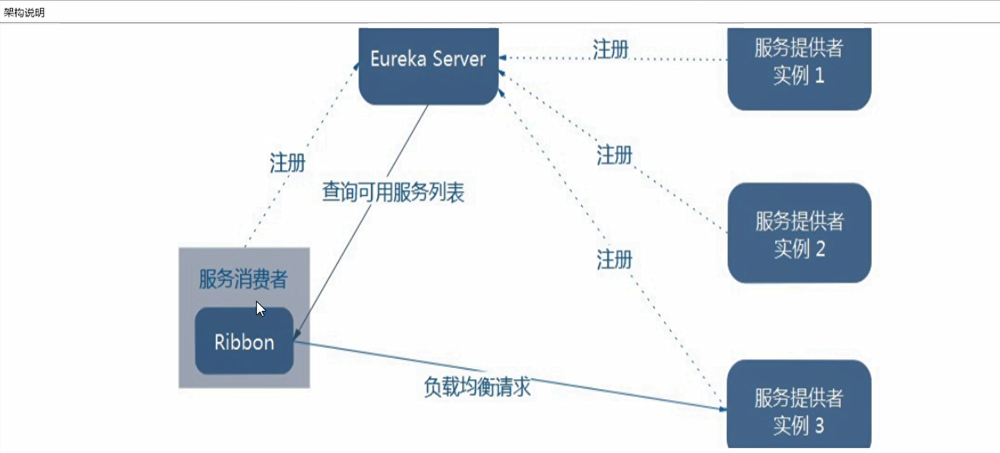

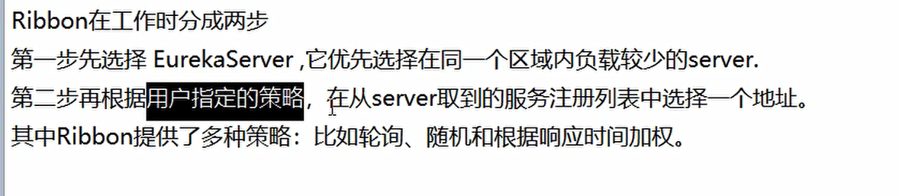

ribbon默认自带的负载均衡规则由以下其中:

1. ==**com.netflix.loadbalancer.RoundRibbonRule: 轮询(默认使用)**==
2. ==**com.netflix.loadbalancer.RandomRule: 随机**==
3. ==**com.netflix.loadbalancer.RetryRule: 先按照RoundRibbonRule的策略获取服务, 如果获取服务失败则在指定时间内会进行重试**==
4. ==**com.netflix.loadbalancer.WeihtedResponseTimeRule: 对RoundRibbonRule的扩展, 响应速度越快的实例选择权重越大, 越容易被选择**==
5. ==**com.netflix.loadbalancer.BestAvailableRule: 会过滤掉由于多次访问故障而处于断路器跳闸状态的服务, 然后选择一个并发量最小的服务**==
6. ==**com.netflix.loadbalancer.AvailabilityFilteringRule: 先过滤掉实例故障, 再选择并发较小的实例**==
7. ==**com.netflix.loadbalancer.ZoneAvoidanceRule: 符合判断server所在区域的性能和server的可用性选择服务器**==

### LoadBalance

#### 如何更换负载均衡规则

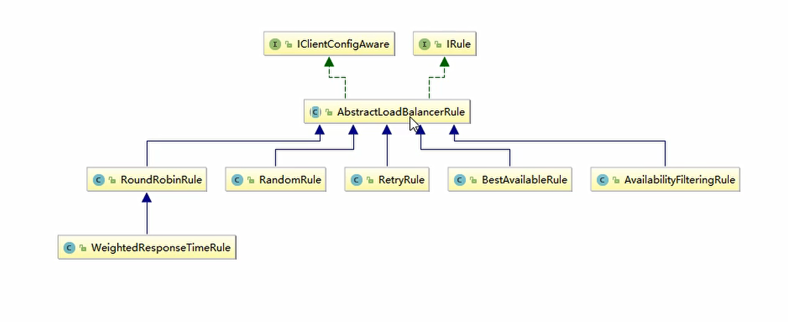

1. **往容器中添加响应的配置类**, 但是这个自定义的配置类**==不能放在@ComponentScan所扫描的当前包下以及子包下==**, 否则我们自定义的这个配置类就会被所有的Ribbon客户端所共享, 达不到特殊化定制的目了.
2. 在消费者主启动类上添加注解@RibbonClient

```java
/**
 * @Author jacklu
 * @Date 11:13:53 2021/02/10
 */
@Configuration
public class MySelfRule {
    @Bean
    public IRule myRule(){
        //定义Ribbon的负载均衡规则为随机
        return new RandomRule();
    }
}
```

```java
/**
 * @Author jacklu
 * @Date 13:03:04 2021/02/08
 */
@SpringBootApplication
@EnableEurekaClient
//指定使用Ribbon客户端来对CLOUD-PAYMENT-SERVICE应用进行负载均衡, 负载均衡的自定义配置在MyySelfRule这个类中
//不指定配置类则使用默认的负载均衡机制(轮询)
@RibbonClient(name = "CLOUD-PAYMENT-SERVICE",configuration = MySelfRule.class)
public class OrderMain80 {
    public static void main(String[] args) {
        SpringApplication.run(OrderMain80.class, args);
    }
}
```


#### 负载均衡算法原理:

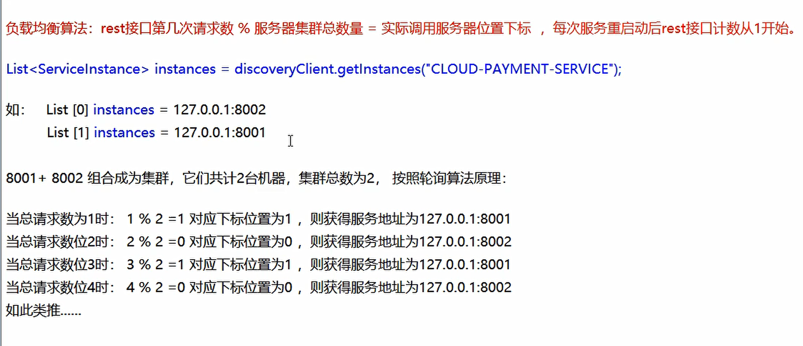


#### 自己手动写一个负载均衡

1. 定义接口, 根据某个应用下的所有服务实例返回具体的服务实例

```java

/**
 * @Author jacklu
 * @Date 12:40:33 2021/02/10
 */
public interface LoadBalancer {
    /**
     *
     * @param serviceInstances 某个应用下的所有服务实例
     * @return 具体的服务实例
     */
    ServiceInstance instance(List<ServiceInstance> serviceInstances);
}
```

2. 对接口进行实现

```java
/**
 * @Author jacklu
 * @Date 12:43:44 2021/02/10
 */
@Component
public class MyLB implements LoadBalancer {

    //原子整数, 线程安全
    private AtomicInteger atomicInteger = new AtomicInteger(0);

    /**
     * 这段代码很精妙, 自旋锁来发现自己是第几次访问
     * @return 第几次访问
     */
    public final int getAndIncrement() {
        int current;
        int next;
        do {
            current = this.atomicInteger.get();
            next = current >= Integer.MAX_VALUE ? 0 : current + 1;
            //自旋
        } while (!this.atomicInteger.compareAndSet(current, next));
        System.out.println("*******第几次访问, 次数next:" + next);
        return next;
    }

    /**
     *  负载均衡算法: rest接口第几次请求数 % 服务器集群总数量 = 实际调用服务器位置下标, 每次服务启动后	   *rest接口计数从1开始
     * @param serviceInstances 某个应用下的所有服务实例
     * @return 具体的服务实例
     */
    @Override
    public ServiceInstance instance(List<ServiceInstance> serviceInstances) {
       int index =  getAndIncrement() % serviceInstances.size();
        return serviceInstances.get(index);
    }
}
```

负载均衡已经定义好了, 下面就直接使用了(访问接口: /consumer/payment/lb测试即可)

```java
	@Resource
    private DiscoveryClient discoveryClient;

    //引入自己定义的聚在均衡器
    @Resource
    private LoadBalancer loadBalancer;

 @GetMapping("/consumer/payment/lb")
    public String getPaymentLB(){
        //使用discoverClient获取CLOUD-PAYMENT-SERVICE应用下的所有服务
        List<ServiceInstance> instances = discoveryClient.getInstances("CLOUD-PAYMENT-SERVICE");
        if(instances == null || instances.size() <= 0){
            return null;
        }
        ServiceInstance instance = loadBalancer.instance(instances);
        URI uri = instance.getUri();
        return restTemplate.getForObject(uri+"/payment/lb", String.class);
    }

```


### Openfeign

是什么?

feign是一个声明式WebService客户端, 使用Feign能让编写WebService客户端更加简单, **==简单的来说就是用来做微服务的接口调用的, 使用于消费端,在实际开发过程中我们更偏向于这种方式==**

**==它的使用方法是定义一个服务接口然后在上面添加注解, Feign可以与Eureka和Ribbon组合使用可以支持负载均衡==**

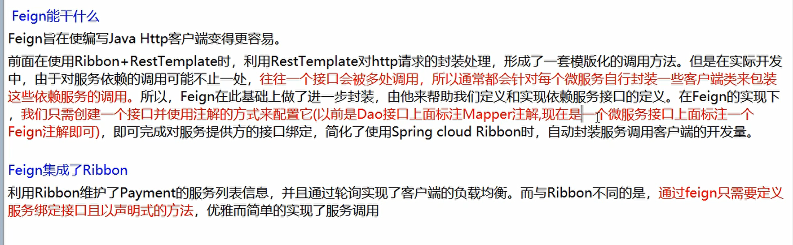


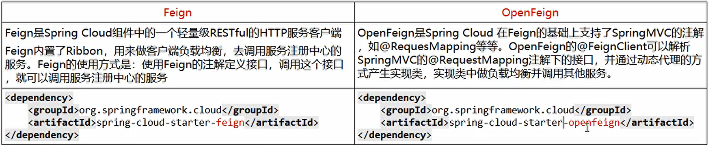


#### 使用

接口加注解:

1. 引入依赖(分析依赖知道openfeign已经引入了ribbon, 已经具备了负载均衡的能力了)

```xml
	    <dependency>
            <groupId>org.springframework.cloud</groupId>
            <artifactId>spring-cloud-starter-openfeign</artifactId>
        </dependency>
```

2. 消费者主启动类加注解

```java
@SpringBootApplication
//开启Feign服务调用
@EnableFeignClients
public class OrderFeigbMain80 {
    public static void main(String[] args) {
        SpringApplication.run(OrderFeigbMain80.class, args);
    }
}
```

3. 声明openfeign的服务接口用来调用其他服务接口

```java
/**
 * @Author jacklu
 * @Date 16:11:43 2021/02/10
 */
@Component
//指明要调用哪个应用下面的服务, 接口体要声明调用的具体服务
@FeignClient(value = "CLOUD-PAYMENT-SERVICE")
public interface PaymentFeignService {

    //其他模`块Controller层的访问地址和方法
    @GetMapping(value = "/payment/get/{id}")
    CommentResult<Payment> getPaymentById(@PathVariable("id") Long id);

}
```

4. 使用openfeign(直接注入接口使用即可)

```java
@RestController
@Slf4j
public class OrderFeignController {

    @Resource
    private PaymentFeignService paymentFeignService;

    @GetMapping("/consumer/payment/get/{id}")
    public CommentResult<Payment> getPaymentById(@PathVariable("id") Long id){
        return paymentFeignService.getPaymentById(id);
    }

}
```

使用总结:

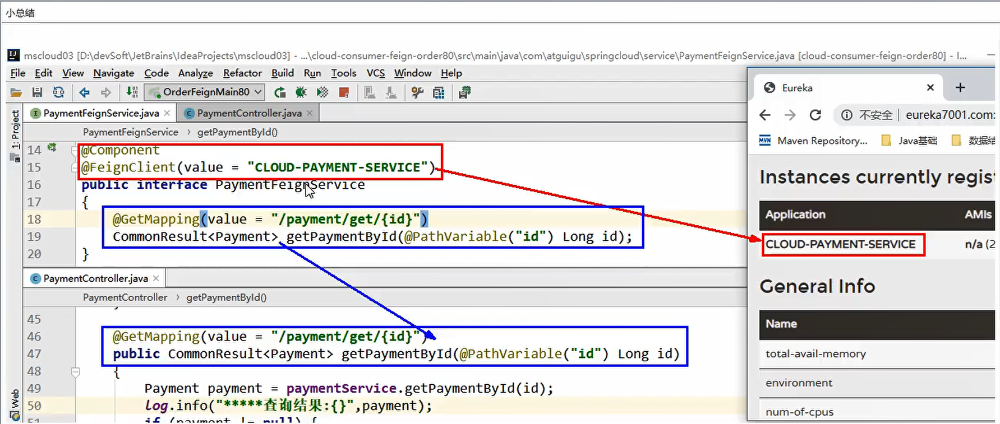


#### 超时控制

**==openfeign服务调用的默认等待时间是一秒钟==**, 如果某个服务的处理超过了一秒钟openfeign就不想等待了, 直接返回报错, 所以我们要进行超时控制, openfeign整合了ribbon, 我们的超时控制就是对ribbon的配置

```properties
ribbon:
#  指的是建立连接所使用的时间, 适用于网络状况正常的情况下, 两端连接所用的时间
  ReadTimeout:  5000
#  指的是建立连接后从服务器读取到可用资源所用的时间
  ConnectTimeout: 5000
```


#### 日志打印

通过日志打印可以了解feign中http请求的细节, 说白了就是对Feign接口的调用情况进行监控和输出

四个日志级别:

1. ==NONE==: 默认的, 不显示任何日志
2. ==BASIC==:  仅记录请求方法, URL, 响应状态码及执行时间
3. ==HEADERS==: 除了BASIC定义的信息之外, 还有请求和响应的头信息
4. ==FULL==: 除了HEADERS定义的信息之外, 还有请求和响应的正文及元数据


如何开启日志功能?

1. 往容器中添加bean

```java
/**
 * @Author jacklu
 * @Date 21:11:26 2021/02/15
 */
@Configuration
public class FeignConfig {

    @Bean
    Logger.Level feignLoggerLevel() {
        return Logger.Level.FULL;
    }
}
```

2. yml文件开启feign客户端的日志

```properties
logging:
  level:
#    feign日志以什么级别监控哪个接口
    com.atguigu.springcloud.service.PaymentFeignService: debug
```


## 服务降级

1. 是什么


几个重要的概念:

1. 降级(fullback):  当服务发生故障之后, 向调用方返回一个符合预期的, 可处理的备选响应(服务器繁忙, 请稍后再试, 不让客户等待并立即返回一个友好提示, fallback)
2. 熔断(break): 类比保险丝达到最大服务访问后, 直接拒绝访问, 拉闸限电, 然后调用服务降级的方法并返回友好提示
3. 限流(limit): 秒杀高并发等操作, 严禁一窝蜂的过来拥挤, 大家排队, 一秒钟n个, 有序进行


### Hystrix

  hystrix如何进行降级(==当不符合我们的预期效果时指定候选方案, 可以在客户端, 也可以在服务端==)?

#### 在服务端开启服务降级:

1. 引入依赖

```xml
        <dependency>
            <groupId>org.springframework.cloud</groupId>
            <artifactId>spring-cloud-starter-netflix-hystrix</artifactId>
        </dependency>
```

2. 开启断路器

```java
@EnableCircuitBreaker
public class PaymentHystrixMain8001 {
	...
}
```

3. 在方法上使用注解@HystrixCommand即可

```java
 /**
     * 服务的降级操作, 当服务出现异常或者超时或者宕机的时候采取的候补措施
     * 指定候补措施为paymentInfo_TimeOutHandler方法
     * @param id
     * @return
     */
    @HystrixCommand(fallbackMethod = "paymentInfo_TimeOutHandler", commandProperties = {
            //超过3秒还没有返回结果或者报错就执行候补措施
            @HystrixProperty(name = "execution.isolation.thread.timeoutInMilliseconds",value = "3000")
    })
    public String paymentInfo_TimeOut(Integer id) {
     ...
    }

    public String paymentInfo_TimeOutHandler(Integer id){
        ...
    };

```


#### 在客户端开启服务降级:

1. 开yml中开启feign中的hystrix

```properties
feign:
  hystrix:
    enabled: true
```

2. 在主启动类上开启Hystrix

```java
@EnableHystrix
@SpringBootApplication
public class OrderHystrixMain80 {
    public static void main(String[] args) {
        SpringApplication.run(OrderHystrixMain80.class, args);
    }
}
```

3. 使用Hystrix注解进行降级

```java
/**
 * @Author jacklu
 * @Date 12:48:38 2021/02/16
 */
@RestController
public class OrderHystrixController {

    //openfeign接口
    @Resource
    private PaymentHystrixService paymentHystrixService;

    @GetMapping("/consumer/payment/hystrix/timeout/{id}")
    @HystrixCommand(fallbackMethod = "paymentTimeOutFallbackMethod",commandProperties = {
         //超过1.5秒还没有返回结果或者报错就执行候补措施   
        @HystrixProperty(name = "execution.isolation.thread.timeoutInMilliseconds",value = "1500")
    })
    public String paymentInfo_TimeOut(@PathVariable("id") Integer id){
        String result = paymentHystrixService.paymentInfo_TimeOut(id);
        return result;
    }

    //候选方法
    public String paymentTimeOutFallbackMethod(@PathVariable("id") Integer id){
        return "我是消费者80，对付支付系统繁忙请10秒钟后再试或者自己运行出错请检查自己,(┬＿┬)";
    }
}
```


---


问题分析:

上述的每一个方法我们都要为它声明一个候选方案, 这样就会让代码变得冗余且业务代码跟非业务代码混杂在了一块

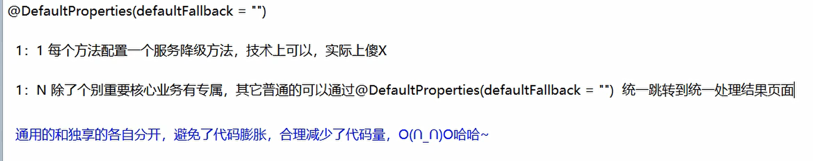


---

#### 如何简化服务降级时的候选方案?

1. 在类上标注解@DefaultProperties

```java
//指明服务降级的时候默认的fallback用哪一个方法
@DefaultProperties(defaultFallback = "payment_Global_FallbackMethod")
public class OrderHystrixController {
	 //下面是全局fallback方法
    public String payment_Global_FallbackMethod(){
        return "Global异常处理信息, 请稍后再试, /(ㄒoㄒ)/~~";
    }
}
```

2. 在这个类中使用候选方案时不用再指明fallbackMethod, 直接使用注解@HystrixCommand即可, 如果指明了则使用指明的fallbackMethod

```java
//指明服务降级的时候默认的fallback用哪一个方法
@DefaultProperties(defaultFallback = "payment_Global_FallbackMethod")
public class OrderHystrixController {
	 //下面是全局fallback方法
    public String payment_Global_FallbackMethod(){
        return "Global异常处理信息, 请稍后再试, /(ㄒoㄒ)/~~";
    }
    
    @GetMapping("/consumer/payment/hystrix/timeout/{id}")
    @HystrixCommand
    public String paymentInfo_TimeOut(@PathVariable("id") Integer id){
        String result = paymentHystrixService.paymentInfo_TimeOut(id);
        return result;
    }
}
```


上述只是简化了候选方案, 使用了全局的候选方案, 但是并没有做到解耦, 即业务逻辑还是和非业务逻辑混杂在一块

**==既然我们是对微服务进行调用, 那么我们就可以从调用的接口着手来进行候选方案的解耦==**

#### 如何优雅的对服务降级时的候选方案进行解耦?

有如下微服务接口:

```java
/**
 * @Author jacklu
 * @Date 12:45:52 2021/02/16
 */
@Component
@FeignClient(value = "CLOUD-PROVIDER-HYSTRIX-PAYMENT")
public interface PaymentHystrixService {
    @GetMapping("/payment/hystrix/ok/{id}")
    public String paymentInfo_OK(@PathVariable("id") Integer id);

    @GetMapping("/payment/hystrix/timeout/{id}")
    public String paymentInfo_TimeOut(@PathVariable("id") Integer id);
}
```

1. 在yml中开启feign对hystrix的支持

```properties
feign:
  hystrix:
    enabled: true
```


2. 创建一个类来实现FeignClient接口, **==并把该类添加到容器中==**

```java
/**
 * @Author jacklu
 * @Date 14:55:30 2021/02/16
 */
//该类就是服务降级的候选方案
@Component
public class PaymentFallbackService implements PaymentHystrixService{
    @Override
    public String paymentInfo_OK(Integer id) {
        return "-----PaymentFallbackService fall back-paymentInfo_OK,/(ㄒoㄒ)/~~";
    }

    @Override
    public String paymentInfo_TimeOut(Integer id) {
        return "-----PaymentFallbackService fall back-paymentInfo_TimeOut,/(ㄒoㄒ)/~~";
    }
}
```

3. 微服务接口降级时使用该候选方案(@FeignClient指定fallback是哪个实现了给接口的类), 这时就不用再使用@HystrixCommand注解了, 因为我们已经为微服务的方法制定了fallback, 再加@HystrixCommand就会出错

```java
@Component
@FeignClient(value = "CLOUD-PROVIDER-HYSTRIX-PAYMENT", fallback = PaymentFallbackService.class)
public interface PaymentHystrixService {
    @GetMapping("/payment/hystrix/ok/{id}")
    public String paymentInfo_OK(@PathVariable("id") Integer id);

    @GetMapping("/payment/hystrix/timeout/{id}")
    public String paymentInfo_TimeOut(@PathVariable("id") Integer id);
}
```

4. 服务调用

```java
@RestController
public class OrderHystrixController {

    //openfeign接口
    @Resource
    private PaymentHystrixService paymentHystrixService;
    
    @GetMapping("/consumer/payment/hystrix/timeout/{id}")
    public String paymentInfo_TimeOut(@PathVariable("id") Integer id){
        String result = paymentHystrixService.paymentInfo_TimeOut(id);
        return result;
    }
}  
```


## 服务熔断

### Hystrix

什么是服务熔断?**==(熔断的一般过程:  降级 => 熔断 => 恢复链路)==**

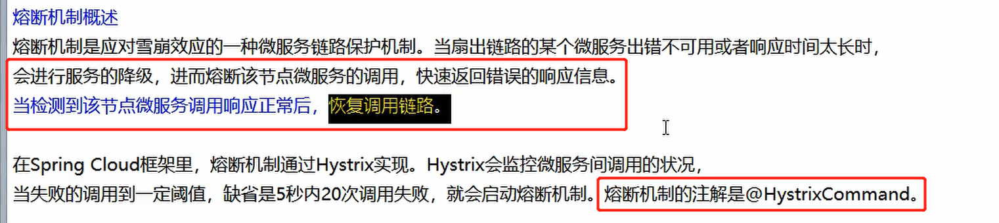


**==熔断的状态有三种类型:==**

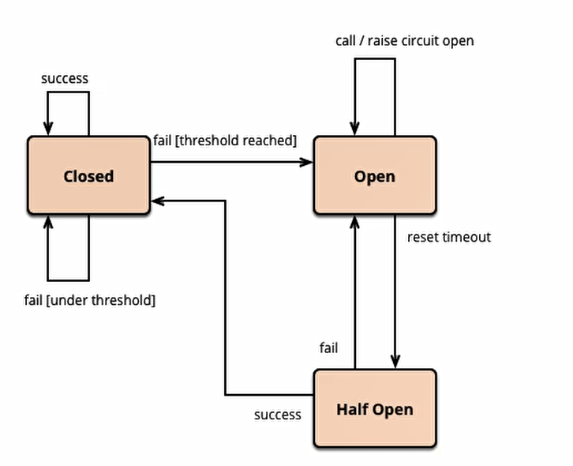

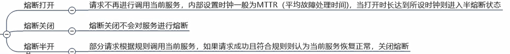


服务的熔断直接使用注解@HystrixCommand

```java
 //===============服务熔断
//在10s内十次的请求次数失败率达到百分之60之后跳闸, 后面多次访问正确了才慢慢恢复链路的调用
    @HystrixCommand(fallbackMethod = "paymentCircuitBreaker_fallback",commandProperties = {
            @HystrixProperty(name = "circuitBreaker.enabled",value = "true"),  //是否开启断路器
            @HystrixProperty(name = "circuitBreaker.requestVolumeThreshold",value = "10"),   //请求次数
            @HystrixProperty(name = "circuitBreaker.sleepWindowInMilliseconds",value = "10000"),  //时间范围
            @HystrixProperty(name = "circuitBreaker.errorThresholdPercentage",value = "60"), //失败率达到多少后跳闸
    })
    public String paymentCircuitBreaker(@PathVariable("id") Integer id){
        if (id < 0){
            throw new RuntimeException("*****id 不能负数");
        }
        String serialNumber = IdUtil.simpleUUID();

        return Thread.currentThread().getName()+"\t"+"调用成功,流水号："+serialNumber;
    }
```

什么时候进行熔断?

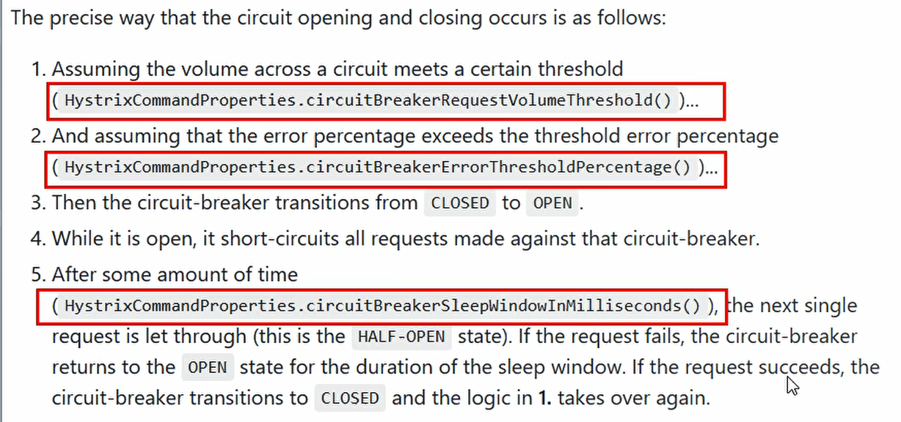

##### 

#### 断路器的三个重要的参数:

1. 快照时间窗(circuitBreaker.sleepWindowInMilliseconds):  短路器确定是否打开需要统计一些请求和错误数据, 而统计的时间范围就是快照时间窗, 默认为最近的10s
2. 请求总数阈值(circuitBreaker.requestVolumeThreshold): 在快照时间窗内, 必须满足请求总数阈值才有资格熔断, 默认为20, 意味着在10s内, 如果该Hystrix命令的调用次数不足20次, 即使所有的请求都超时或其他原因失败, 断路器都不会打开
3. 错误百分比阈值(circuitBreaker.errorThresholdPercentage): 当请求总数在快照时间窗内超过了阈值, 比如发生了30次调用, 如果在这30次调用中, 有15次发生了超时异常,在设定50%阈值的情况下, 这时候就会将断路器打开


#### Hystrix所有配置参数:

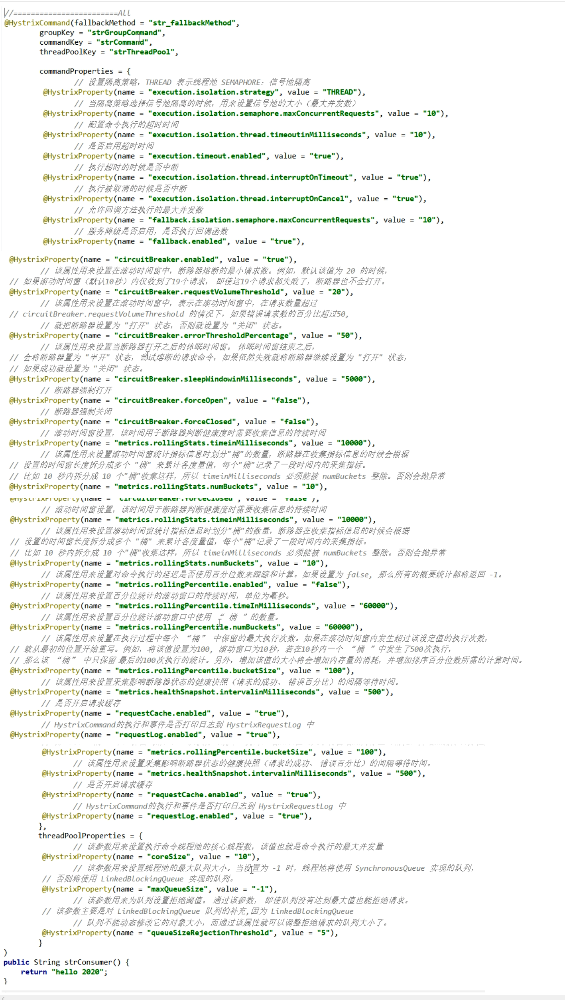


#### 服务监控:

除了隔离依赖服务的调用以外, Hystrix还提供了准实时的调用监控(Hystrix Dashboard),  Hystrix会持续的记录所有通过Hystrix发起的请求的执行信息, 并以统计报表和图形的形式展示给用户, 包括每秒多少请求执行成功, 多少失败等. Netflix通过hystrix-metrics-event-stream项目实施了对以上指标的监控, SpringCloud也提供了Hystrix Dashboard的整合, 对监控内容转化成可是界面.

如何使用:

1. 引入依赖:

```properties
 		<!--新增hystrix dashboard-->
        <dependency>
            <groupId>org.springframework.cloud</groupId>
            <artifactId>spring-cloud-starter-netflix-hystrix-dashboard</artifactId>
        </dependency>
        
        <!--图形监控的依赖, 凡是监控的, 这个依赖都要有-->
        <dependency>
            <groupId>org.springframework.boot</groupId>
            <artifactId>spring-boot-starter-actuator</artifactId>
        </dependency>
```

2. 开启HystrixDashboard功能

```java
/**
 * @Author jacklu
 * @Date 10:53:57 2021/03/08
 */
@SpringBootApplication
@EnableHystrixDashboard
public class HystrixDashboardMain9001 {
    public static void main(String[] args) {
        SpringApplication.run(HystrixDashboardMain9001.class, args);
    }
}
```

如何检测Hystrix图形界面是否搭建成功?

启动项目, 直接访问:http://localhost:9001/hystrix, 如果出现以下界面则说明成功:

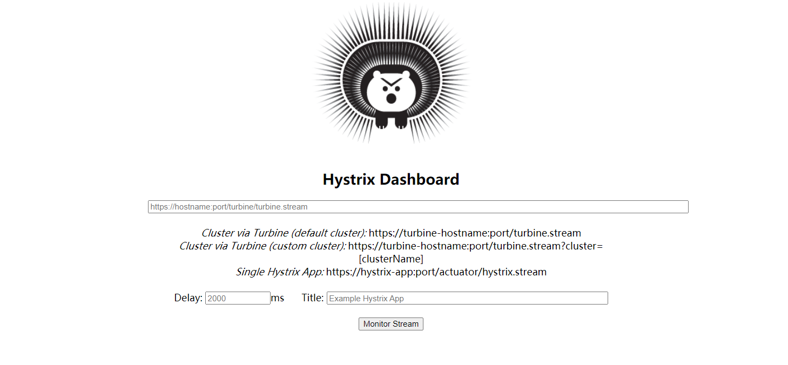


##### 指定监控路径:

要监控哪一个Hystrix就要在哪一个主启类上指定监控路径

```java
/**
 * @Author jacklu
 * @Date 21:56:17 2021/02/15
 */
@SpringBootApplication
@EnableEurekaClient
@EnableCircuitBreaker
public class PaymentHystrixMain8001 {
    public static void main(String[] args) {
        SpringApplication.run(PaymentHystrixMain8001.class, args);
    }


    /**
     * 新版的Hystrix需要在被监控的主启类上指定监控路径
     * 此配置是为了服务监控而配置, 与服务容错本身无关, springcloud升级后的坑
     * ServletRegistrationBean因为springboot的默认路径不是"/hystrix.stream",
     * 只要在自己的项目里面配置上下面的servlet就可以了
     * @return
     */
    @Bean
    public ServletRegistrationBean getServlet(){
        HystrixMetricsStreamServlet streamServlet = new HystrixMetricsStreamServlet();
        ServletRegistrationBean registrationBean = new ServletRegistrationBean(streamServlet);
        registrationBean.setLoadOnStartup(1);
        registrationBean.addUrlMappings("/hystrix.stream");
        registrationBean.setName("HystrixMetricsStreamServlet");
        return registrationBean;
    }

}
```

做好了上述的步骤之后, 就可以进行监控我们的Hystrix了


##### 如何监控:

1. 端口(要监控的端口)+/hystrix.stream(根据上面的配置, /hystrix.stream就能映射到我们HystrixMetricsStreamServlet Bean)

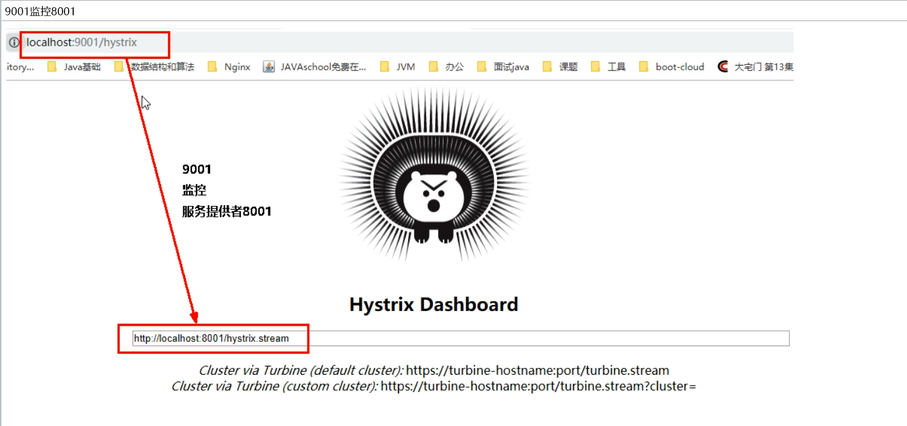

然后直接点击Monitor Stream就可以进行监控了

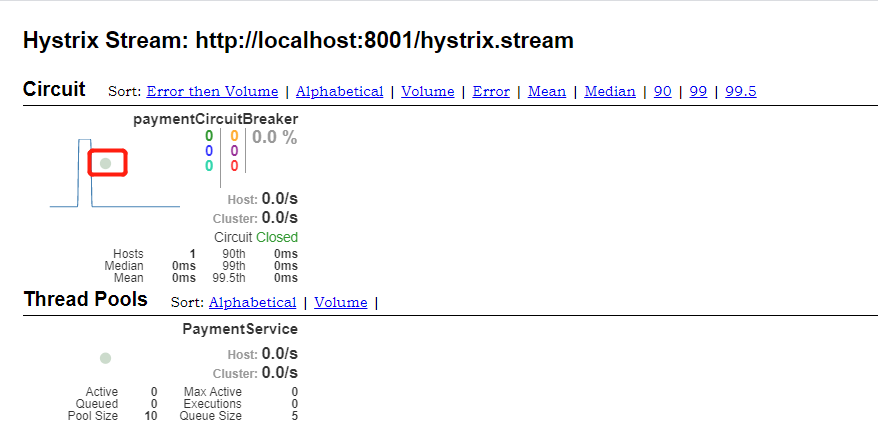

上面监控图中实心圆的含义:

1. 通过颜色的变化代表了实例的健康程度, 它的健康度从绿黄橙红递减
2. 根据请求的流量发生大小的变化, 流量越大该实心圆就越大. 所以通过该实心圆的展示, 就可以在大量的实例中快速的发现故障实例和高压力实例

曲线的含义:

1. 用来记录两分钟内流量的相对变化, 可以通过它来观察到流量的上升和下降趋势

整图说明:

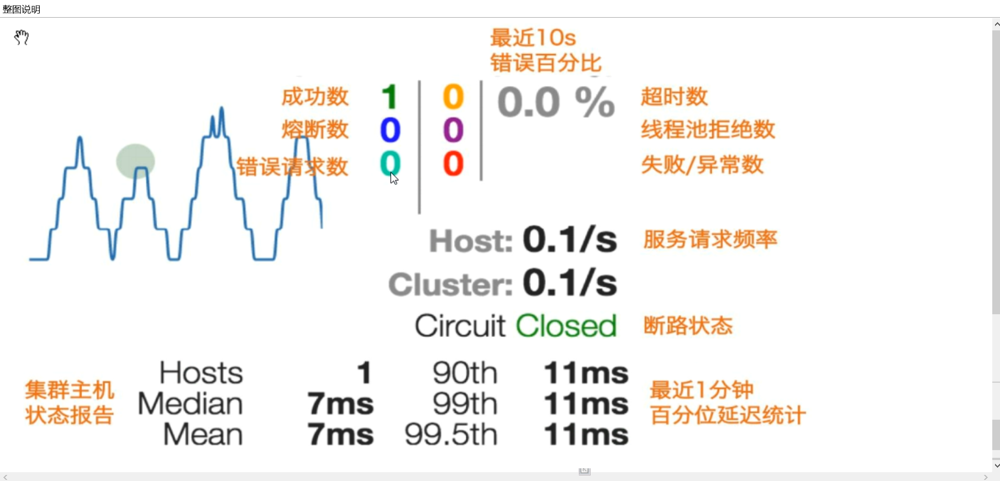

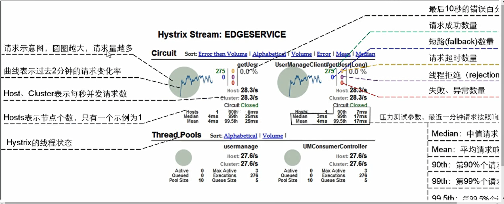


---


## 网关

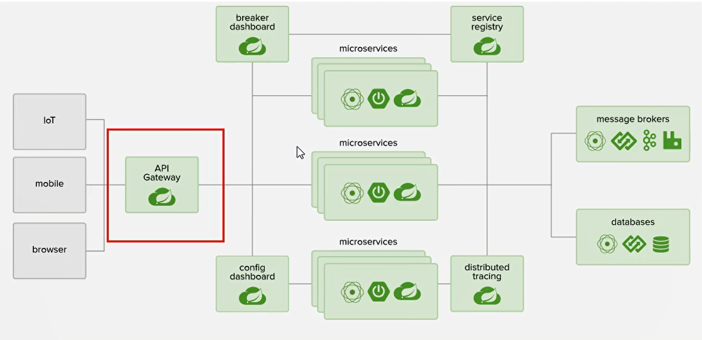

能做什么?

**==提供一种简单而有效的方式来对API进行路由, 以及提供一些强大的过滤器功能, 例如: 熔断, 限流, 重试等等==**

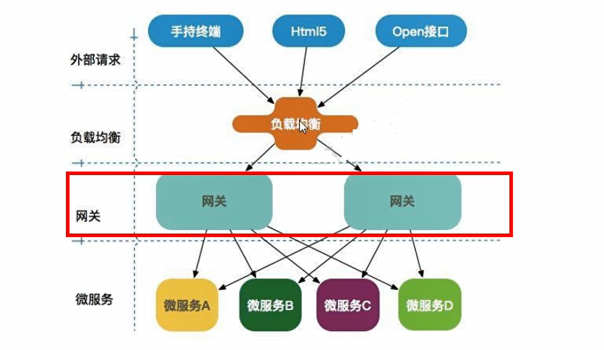

### Gateway三大核心概念

1. ==**Route(路由): 路由是构建网关的基本模块, 他由ID, 目标URI, 一系列的断言和过滤器组成, 如果断言为true则匹配改路由**==
2. ==**Predicate(断言): 参考java8的java.util.function.Predicate, 开发人员可以匹配HTTP请求中的所有内容(例如请求头或请求参数), 如果请求与断言相匹配则进行路由**==
3. ==**Filter(过滤): 指的是spring框架中GatewayFilter的实例, 使用过滤器, 可以在请求被路由或者之后对请求进行修改**==

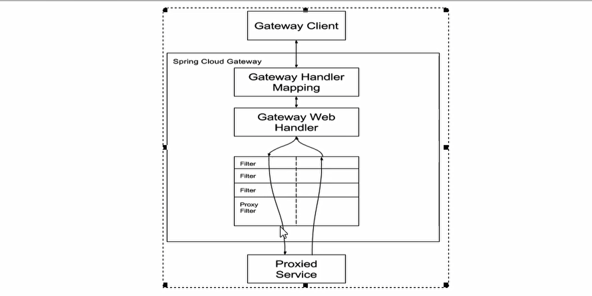

### 网关如何使用?

1. 引入依赖

```xml
 <!--新增gateway-->
        <dependency>
            <groupId>org.springframework.cloud</groupId>
            <artifactId>spring-cloud-starter-gateway</artifactId>
        </dependency>
```

2. **==将网关注册到我们的注册中心和网关路由的配置==**

```properties
server:
  port: 9527
spring:
  application:
    name: cloud-gateway
  cloud:
    gateway: #网关路由的配置还可以用编码的方式来实现, 如下列2.1
      routes:
      - id: payment_routh #路由的ID，没有固定规则但要求唯一，建议配合服务名
        uri: http://localhost:8001   #匹配后提供服务的路由地址
        predicates:
          - Path=/payment/get/**   #断言,路径相匹配的进行路由

      - id: payment_routh2
        uri: http://localhost:8001
        predicates:
          - Path=/payment/lb/**   #断言,路径相匹配的进行路由


eureka:
  instance:
    hostname: cloud-gateway-service
  client:
    service-url:
      register-with-eureka: true
      fetch-registry: true
      defaultZone: http://eureka7001.com:7001/eureka
```

2.1 网关路由配置的编码实现方式, 代替上面的配置文件配置

```java

/**
 * @Author jacklu
 * @Date 23:00:14 2021/03/10
 */
@Configuration
public class GateWayConfig {
    /**
     * 配置了一个id为route-name的路由规则,
     * 当访问地址http://localhost:9527/guonei时会自动转发到地址http://news.baidu.com/guonei
     * @param routeLocatorBuilder
     * @return
     */
    @Bean
    public RouteLocator customerRoutLocator(RouteLocatorBuilder routeLocatorBuilder){
        RouteLocatorBuilder.Builder routes = routeLocatorBuilder.routes();
        //路由的id可以自己随便起名, 但是要保证是唯一的
        routes.route("path_route_atguigu",r->r.path("/guonei").uri("http://news.baidu.com/guonei")).build();
        return routes.build();

    }
}
```


### 网关来实现负载均衡:

修改yml:  spring.cloud.gateway.discovery.enabled = true, 这样就可以利用微服务名进行路由

```properties
server:
  port: 9527
spring:
  application:
    name: cloud-gateway
  cloud:
    gateway:
      discovery:
        locator:
          enabled: true  #开启从注册中心动态创建路由的功能，利用微服务名进行路由
      routes:
        - id: payment_routh #路由的ID，没有固定规则但要求唯一，建议配合服务名
          uri: lb://cloud-payment-service
          predicates:
            - Path=/payment/get/**   #断言,路径相匹配的进行路由

        - id: payment_routh2
          uri: lb://cloud-payment-service
          predicates:
            - Path=/payment/lb/**   #断言,路径相匹配的进行路由


eureka:
  instance:
    hostname: cloud-gateway-service
    instance-id: gateway9527
  client:
    service-url:
      register-with-eureka: true
      fetch-registry: true
      defaultZone: http://eureka7001.com:7001/eureka
```


### 路由断言

上面我们只用到了路由的路径断言path, 除了path匹配让网关找我们的微服务之外, 我们还可以使用其他断言:

1. **After断言: 在指定的时间之后网关才能访问此微服务, 时间格式是ZoneDateTime类型**

```properties
 routes:
        - id: payment_routh #路由的ID，没有固定规则但要求唯一，建议配合服务名
          uri: lb://cloud-payment-service
          predicates:
            - Path=/payment/get/**   #断言,路径相匹配的进行路由
            #在这个时间之后网关才能匹配到cloud-payment-service这个微服务
            - After=2020-03-08T10:59:34.102+08:00[Asia/Shanghai]
```

2. **Before断言: 跟After断言相同**
3. **Between断言: 跟After断言相同, 时间用逗号隔开**
4. **Cookie断言: 需要两个参数, 一个是cookie名字, 一个是正则表达式. 路由规则会通过获取对应的cookie名字和正则表达式去匹配, 如果匹配上就会执行路由, 如果没有匹配上则不执行**

```properties
- Cookie=jacklu, liuming
```

**测试的时候cookie如何携带呢?**

**请求中携带cookie有很多种方式, 下面用curl的方式来测试:**

**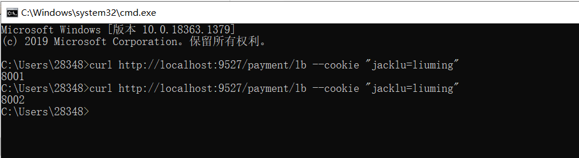**

5. **Header断言: 需要两个参数, 第一个表示请求头要有这个属性, 第二个是一个正则表达式**

```properties
#表示请求头必须有xxx作为key, value用\d+(正则表达式, 表示一个正整数)来进行匹配
- Header=xxx, \d+
```

**测试:**

**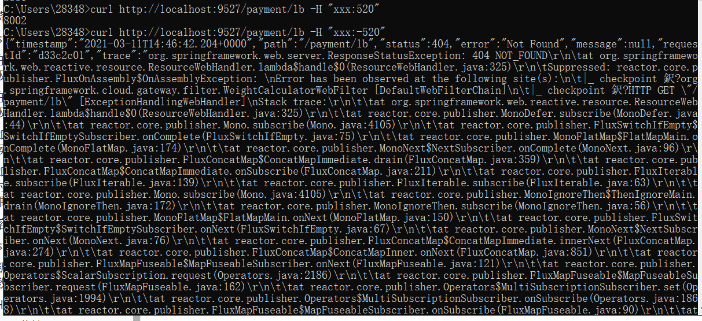**

6. **Host断言:** 

```properties
  - Host=**.atguigu.com
```

**测试:**

**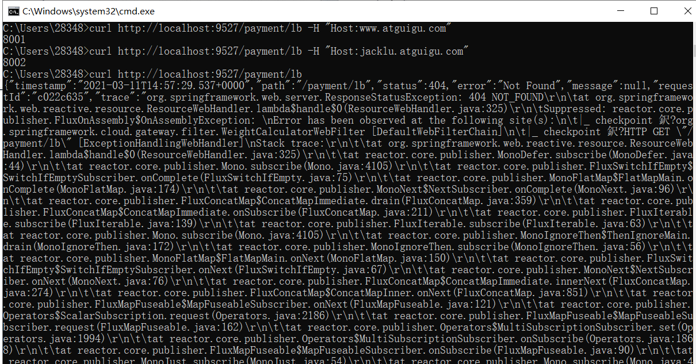**

7. **Method断言:**

```properties
    - Method=GET
```

8. **Path断言:**
9. **Query断言: 地址要有参数名**

```properties
#	/**/?username=520
- Query=username, \d+
```


#### 总结: 

说白了, Predicate就是为了实现一组匹配规则, 让请求找到对应的Route进行处理


***


### gateway的Filter

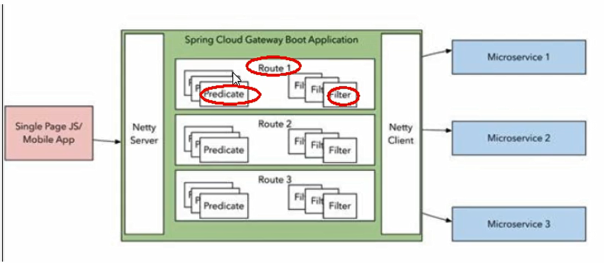

**==路由过滤器可用于修改进入的HTTP请求和返回的HTTP响应, 路由过滤器只能指定路由进行使用, springCoudGateway内置了多种路由过滤器, 他们都由GatewayFilter的工厂类来产生==**


网关的过滤器也可以用配置的方式(**==是路由的一个配置项==**), 下面我演示用编码的方式:(实现响应的接口, 并且把它加到容器中即可)

```java
/**
 * @Author jacklu
 * @Date 23:20:12 2021/03/11
 */
@Component
@Slf4j
public class MyGateWayFilter implements GlobalFilter, Ordered {

    //过滤链
    @Override
    public Mono<Void> filter(ServerWebExchange exchange, GatewayFilterChain chain) {
        log.info("***********come in MyGateWayFilter");
        String username = exchange.getRequest().getQueryParams().getFirst("username");
        if(username == null){
            log.info("***********用户名为null, 非法用户, /(ㄒoㄒ)/~~");
        }
        return chain.filter(exchange);
    }

    //加载的过滤器数字越小, 优先级越高
    @Override
    public int getOrder() {
        return 0;
    }
}

```

这样子我们就必须带上QueryParams为username才会被放行, 测试结果如下:

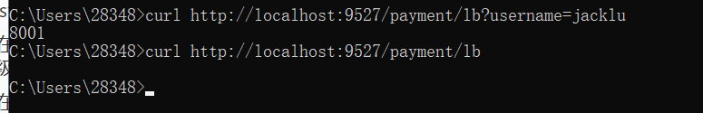


***


## 服务配置

### springcloud config

由于每个服务都需要必要的配置才能运行, 所以一套集中式的, 动态的配置管理设施是必不可少的, springcloud提供了ConfigServer来解决这一个问题. springcloud config为微服务架构中的微服务提供集中化的外部配置支持, 配置服务器为各个不同微服务应用的所有环境提供了一个中心化的外部配置

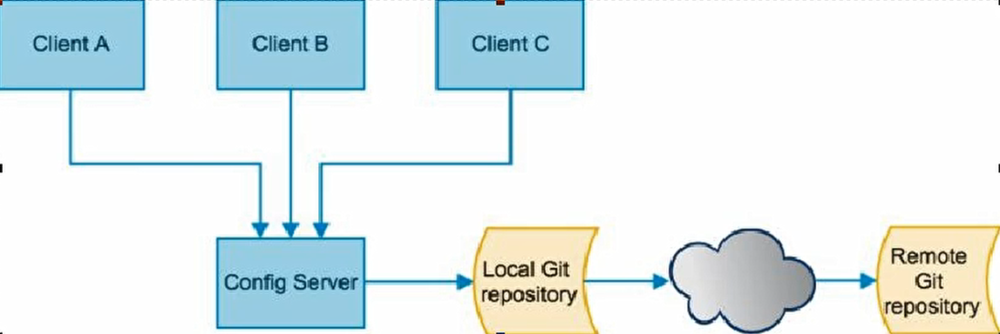

根据上图可知每个微服务都来读取我的config Server这个微服务配置, 所以Config Server也要注册到我们的注册中心, 而Config Server又要跟我们的github进行关联, **==所以我们的配置是托管在github上面的, 通过Config Server就可以读取到github上面的配置==**

---


#### 搭建springcloud config

##### 服务端的配置:

1. 引入依赖

```properties
        <dependency>
            <groupId>org.springframework.cloud</groupId>
            <artifactId>spring-cloud-config-server</artifactId>
        </dependency>
```

我的远程仓库为下图:

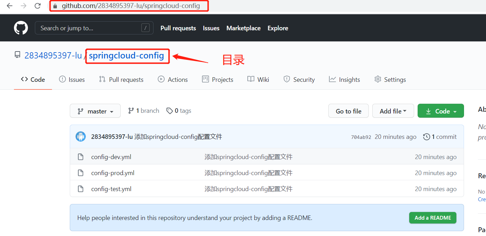

2. 把它注册到我们的注册中心里面, 并且与github远端文件进行一个关联

```properties
server:
  port: 3344
spring:
  application:
    name: cloud-config-center
  cloud:
    config:
      server:
        git:
          uri: https://github.com/2834895397-lu/springcloud-config.git  #填写你自己的github仓库的路径
          search-paths:
            - springcloud-config #搜索的目录
      label: master #读取的分支
eureka:
  client:
    service-url:
      defaultZone:  http://localhost:7001/eureka
```

经过上述步骤我们就把配置中心注册到我们的注册中心中, 并且跟远程仓库进行了关联, 到这里我们的注册中心就可以读取我们的远端文件了

---


##### 配置中心读取远端文件规则: 

1. /{label}/{application}-{profile}.yml(最推荐这种方式)         也就是  **==/分支/文件==**

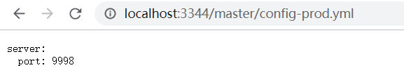

2. /{application}-{profile}.yml  也就是  **==/文件名==**

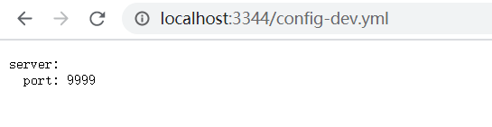

3. /{application}-{profile}/{label}   也就是  **==/文件名/分支==**        **不过这种是把读取的信息封装到json中, 包括了我的一些仓库的信息**

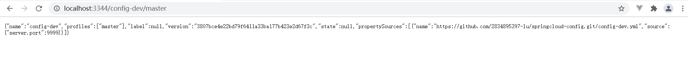

---


##### 客户端的配置

前置知识:

​	application.yml 和 bootstrap.yml: 前者是用户及的配置文件, 后者是系统级的配置文件, **==bootstrap具有更高的优先级, bootstrap配置文件会覆盖application的配置文件, bootstrap绑定的远端配置文件会覆盖bootstrap的配置文件, 他们之间形成互补配置==**

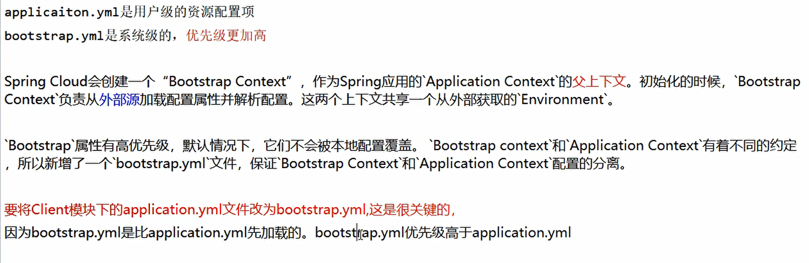


1. 引入依赖

```xml
 		<dependency>
            <groupId>org.springframework.cloud</groupId>
            <artifactId>spring-cloud-starter-config</artifactId>
        </dependency>
```

2. 新建**==bootstrap.yml==**和配置中心的服务端进行关联(**==配置中心客户端也要注册到我们的注册中心==**)

```properties
server:
  port: 3355

spring:
  application:
    name: config-client
  cloud:
    config:
      label: master #分支名称
      name: config #读取的配置文件名称
      profile: dev #读取的文件的后缀名
      #上述三个综合: master分支上config-dev.yml的配置文件被读取http://config-3344.com:3344/master/config-dev.yml
      uri: http://localhost:3344 #配置中心的地址
eureka:
  client:
    service-url:
      defaultZone: http://eureka7001.com:7001/eureka
```

==**经过上述步骤, 配置中心的客户端就可以读取到配置中心服务端的配置文件, 读取的文件为master分支下面的config-dev.yml, 然后这个文件和我们的bootstrap.yml形成互补配置, 配置优先级是 远端 > bootstrap > application, 我们可以直接通过@value("${xxx}")来取得配置文件, 他会按照优先级一个一个的查找这些值**==


远端配置文件内容为:  server.port=9999,  bootstrap为server.port=3355, application为server.port=8006, 在启动的时候我们可以看到是以9999端口启动的:

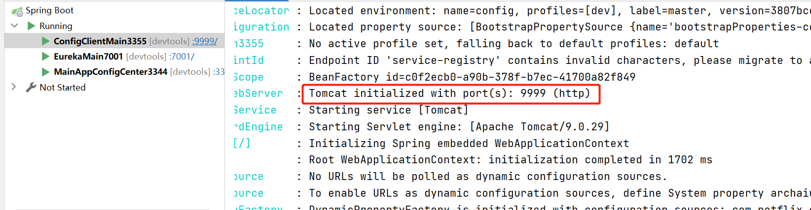

我们可以写一个controller进行测试读取:

```java
/**
 * @Author jacklu
 * @Date 10:13:48 2021/03/14
 */
@RestController
public class ConfigClientController {
    @Value("${server.port}")
    private String configInfo;

    @GetMapping("/configInfo")
    public String getConfigInfo(){
        return configInfo;
    }
}
```

测试结果:


---


##### 动态刷新

当我们从远端的github上面把我们的配置文件改了, 我们的配置中心服务端是能够感知得到的, 但是我们的客户端是感知不到的, 重启客户端可以解决这个问题, 但是这样很麻烦, 这时候就**==需要客户端进行一种动态的刷新==**


1. 客户端引入依赖图形监控的依赖

```xml
		<dependency>
            <groupId>org.springframework.boot</groupId>
            <artifactId>spring-boot-starter-actuator</artifactId>
        </dependency>
```

2. 在客户端的bootstrap.yml里面暴露监控端点

```properties
#暴露监控端点
management:
  endpoints:
    web:
      exposure:
        include: "*"
```

3. 客户端在获取远端配置的类上使用动态刷新注解@RefreshScope

```java
/**
 * @Author jacklu
 * @Date 10:13:48 2021/03/14
 */
@RestController
@RefreshScope
public class ConfigClientController {
    @Value("${server.port}")
    private String configInfo;

    @GetMapping("/configInfo")
    public String getConfigInfo(){
        return configInfo;
    }
}
```

3. **==当我们修改完了远端的配置文件, 要发送一个post请求去刷新客户端的配置, 下面我使用crul的方式发送post请求(固定写法:  配置中心客户端/actuator/refresh)==**

```java
curl -X POST "http://localhost:3355/actuator/refresh"  # 配置中心客户端/actuator/refresh
```

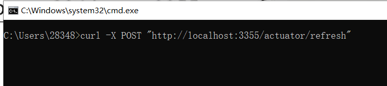


通过上述步骤我们只是实现了手动版的动态刷新, 假如我们有100台配置中心客户端, 我们就要发送一百次post请求来动态的刷新我们的客户端, 这是非常不友好的, 有没有一个办法就是直接进行广播, 一处通知, 处处生效或者直接批量指定哪些机器要动态的读取我们的配置文件, 这就要使用到我们的消息总线了


## 消息总线

SpringCloud Bus 配合 SpringCloud Config使用可以实现配置的动态刷新, SpringCloud Bus目前只支持RabbitMQ和Kafka, 运行原理如图所示, 其实就是让微服务通过订阅的方式来传播我们的事件


### 	两种通知方式:


1. **消息总线通知配置中心的客户端(利用消息总线触发一个客户端/bus/refresh, 而刷新所有客户端的配置)**

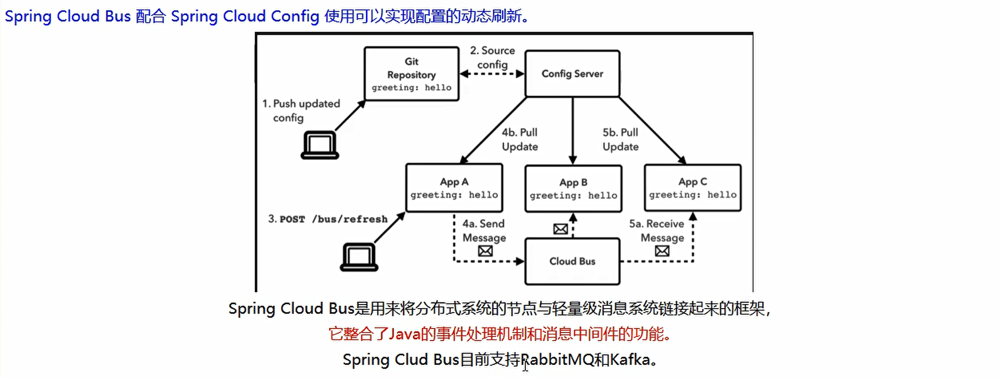


2. **消息总线通知配置中心的服务端(利用消息总线触发一个服务端ConfigServer的/bus/refresh节点, 而刷新所有客户端的配置), 而实际中则更倾向于这种**


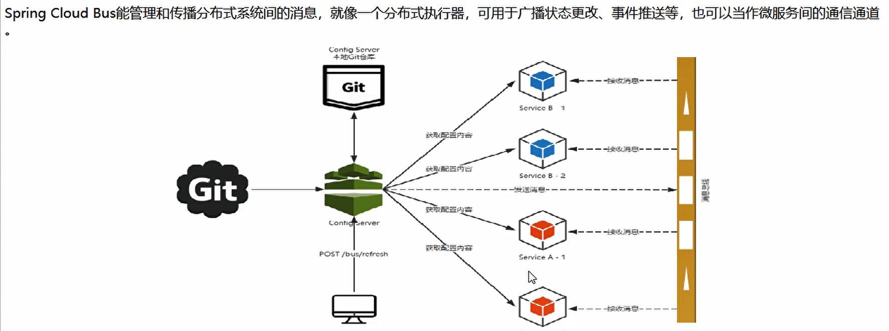


---


**什么是总线:**

​	在微服务架构的系统中, 通常会使用轻量级的消息代理来构建一个共用的消息主题, 并让系统中所有微服务实例都连接上来, 由于该主题中产生的消息会被所有实例监听和消费, 所以称它为消息总线. 在总线上的各个实例, 都可以方便的广播一些需要让其他连接在该主题上的实例都知道的消息.


**基本原理:**

​	==ConfigClient实例都监听MQ中同一topic(默认是SpringCloudBus), 当一个服务刷新数据的时候, 他会把这个消息放入到topic中, 这样其他监听同一个topic的服务就能得到通知, 然后去更新自身的配置==


### 编码实操:

由于我使用的是第二种通知的方式, 也就是让我们的配置中心服务端来通知

#### 配置中心服务端:

1. 添加消息总线的支持

```properties
 <!--添加消息总线rabbitMQ的支持-->
        <dependency>
            <groupId>org.springframework.cloud</groupId>
            <artifactId>spring-cloud-starter-bus-amqp</artifactId>
        </dependency>
        
        <!--监控用到的-->
        <dependency>
            <groupId>org.springframework.boot</groupId>
            <artifactId>spring-boot-starter-actuator</artifactId>
        </dependency>
```

2. 在yml中配置我们的MQ(前提是我们的机子已经安装好了RabbitMQ)

```properties
rabbitmq:
  host: localhost
  port: 5672
  username: guest
  password: guest
  
#rabbitMQ的相关配置, 暴露bus刷新配置的端点
management:
  endpoints: #暴露bus刷新配置的端点, 凡是暴露监控或者刷新, pom里面一定要有actuator依赖
    web:
      exposure:
        include: 'bus-refresh' #固定的, 发送/bus-refresh就能刷新我们的配置中心服务端
```

#### 配置中心客户端:

1. 添加消息总线的支持

```properties
 <!--添加消息总线rabbitMQ的支持-->
        <dependency>
            <groupId>org.springframework.cloud</groupId>
            <artifactId>spring-cloud-starter-bus-amqp</artifactId>
        </dependency>
        
        <!--监控用到的-->
        <dependency>
            <groupId>org.springframework.boot</groupId>
            <artifactId>spring-boot-starter-actuator</artifactId>
        </dependency>
```

2. 在yml中配置我们的MQ(前提是我们的机子已经安装好了RabbitMQ)

```properties
spirng:
	rabbitmq:
    host: localhost
    port: 5672
    username: guest
    password: guest
    
# 暴露端点, 目的就是让我们动态的从远端获取配置文件
management:
  endpoints:
    web:
      exposure:
        include: "*"
```

以上多个配置中心客户端都是同样的配置

做完上述配置之后, 当我们修改了远端仓库的配置文件, 我们只需要个配置中心服务端发送一个post请求即可刷新所有的数据:(**==actuator/bus-refresh为固定请求==**)

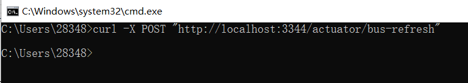

假如说我们想要通知其中某一个的客户端, 我们也可以通过给配置中心服务端发送post请求来指定要通知的客户端(/actuator/bus-refresh/{applicationName:port})

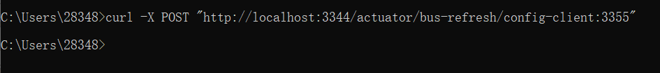

---

上面的整个消息总线和服务配置搭配运行的原理如下图所示:

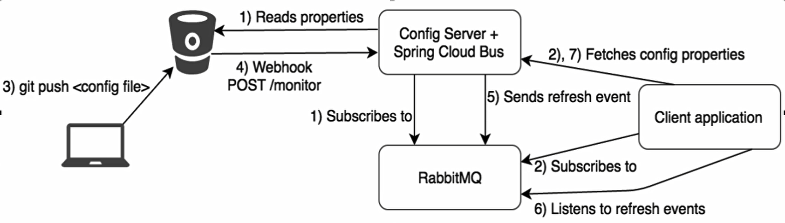


## 消息驱动(spring cloud stream)

为什么要使用消息驱动(cloud stream)?

消息中间件有很多种, 我们希望不需要去记很多种的消息中间件的使用, 希望通过一种就能够操作其他的消息中间件,也就是不再需要关注MQ的细节, 我们只需要用一种适配绑定的方式, 自动的给我们在各种MQ内切换,  消息驱动就应运而生.


### 什么是Spring Cloud Stream?

官方定义: 是一个构建消息驱动微服务的框架

**应用程序可以通过==inputs==或者==outputs==来与Spring Cloud Stream中的==biner==对象交互.**

通过我们配置**==binding==**(绑定), 而Spring Cloud Stream得binder对象负责与消息中间件交互, 所以我们只需要搞清楚如何与Spring Cloud Stream交互就可以方便使用消息驱动的方式. 

通过使用Spring Cloud Integration来连接消息代理中间件以实现消息事件驱动.

Spring Cloud Stream为一些供应商的消息中间件产品提供了个性化的自动化配置实现, 应用了**==发布-订阅, 消息组, 分区==**三个核心概念.

**目前仅支持RabbitMQ和Kafka**


标准的MQ包括基本的三个内容:

1. 消息: Message
2. 通道: 消息必须走指定的通道MessageChannel
3. 处理: 消息通道里面的消息如何被消费: 消息通道MessageChannel的子接口SubscribableChannel, 由MessageHandler消息处理所订阅


为什么要引入cloud stream, 下面来看一幅图:

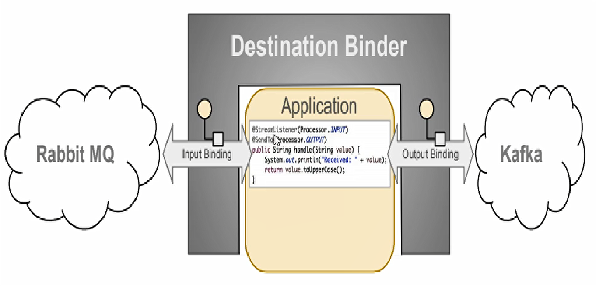


Spring Cloud Stream处理的框架如图所示:

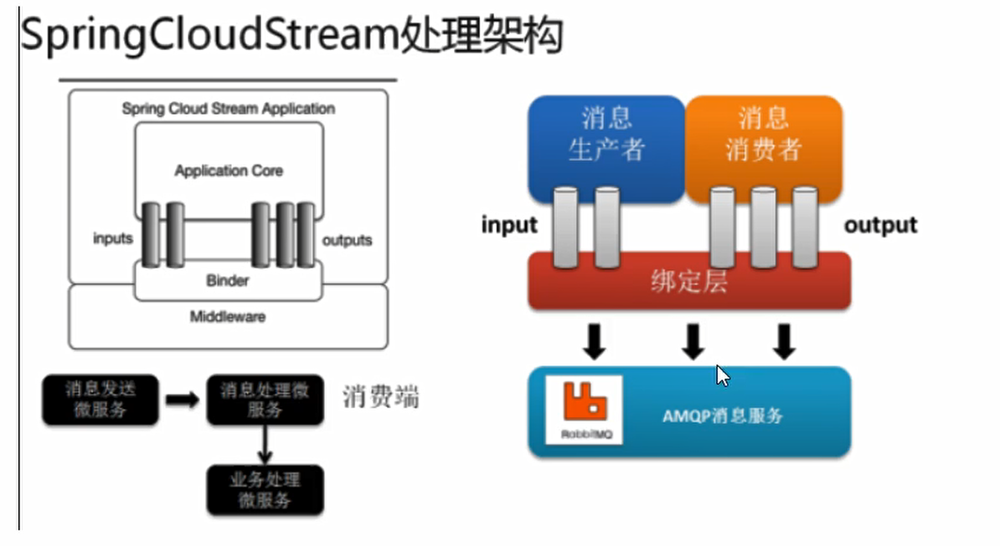

**==通过定义绑定器Binder作为中间层, 实现了应用程序与消息中间件细节之间的隔离==**

详细底层工作流程图:

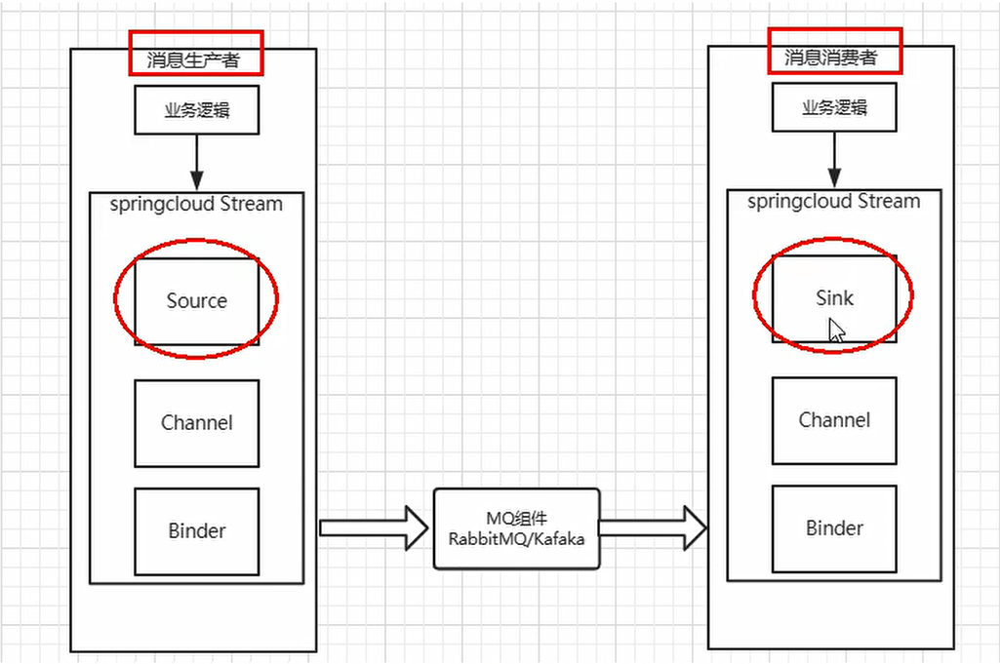

1. Binder: 很方便的**==连接中间件==**, 屏蔽差异
2. Channel: 是队列的一种抽象, 在消息通讯系统中就是**==实现存储和转发的媒介==**, 通过对Channel队列进行配置
3. Source和Sink: 简单的可理解为参照对象是spring cloud stream自身, 从stream发布消息就是输出, 接收消息就是输入


---


### Spring Cloud Stream编码常用api和注解

## 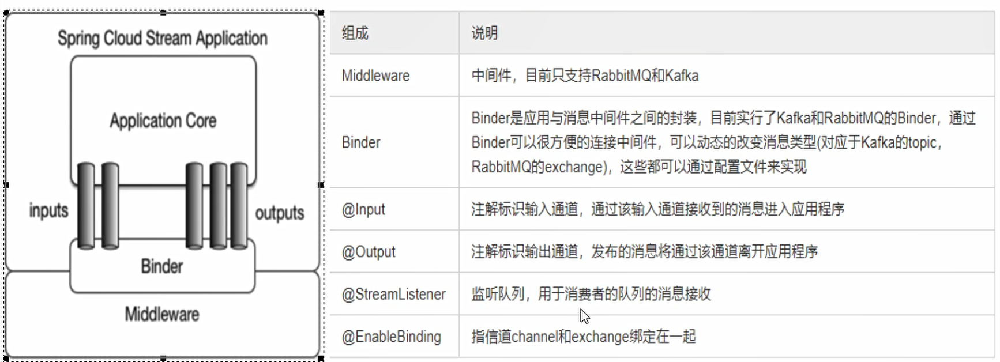


---


### 编码实操:

#### 生产者:

1. 引入依赖:

```xml
	   <dependency>
            <groupId>org.springframework.cloud</groupId>
            <artifactId>spring-cloud-starter-stream-rabbit</artifactId>
        </dependency>
```

2. 改写yml

```properties
spring:
  application:
    name: cloud-stream-provider
  cloud:
    stream:
      binders: # 在此处配置要绑定的rabbitmq的服务信息；
        defaultRabbit: # 表示定义的名称，用于于binding整合
          type: rabbit # 消息组件类型
          environment: # 设置rabbitmq的相关的环境配置
            spring:
              rabbitmq:
                host: localhost
                port: 5672
                username: guest
                password: guest
      bindings: # 服务的整合处理
        output: # 这个名字是一个通道的名称
          destination: studyExchange # 表示要使用的Exchange名称定义
          content-type: application/json # 设置消息类型，本次为json，文本则设置“text/plain”
          binder: defaultRabbit #设置要绑定的消息服务的具体设置
```

3. 使用相关注解进行生产

```java
/**
 * @Author jacklu
 * @Date 10:43:37 2021/03/17
 */
@EnableBinding(Source.class)//定义消息的推送管道, 点进去就知道它里面有一个@Configuration
public class MessageProviderImpl implements IMessageProvider {

    @Resource
    private MessageChannel output; //消息发送管道

    @Override
    public String send() {
        String serial = UUID.randomUUID().toString();
        output.send(MessageBuilder.withPayload(serial).build());
        System.out.println("***********serial:"+ serial);
        return null;
    }
}
```


---

#### 消费者

1. 引入依赖:

```xml
	   <dependency>
            <groupId>org.springframework.cloud</groupId>
            <artifactId>spring-cloud-starter-stream-rabbit</artifactId>
        </dependency>
```

2. 改写yml

```properties
server:
  port: 8802

spring:
  application:
    name: cloud-stream-consumer
  cloud:
    stream:
      binders: # 在此处配置要绑定的rabbitmq的服务信息；
        defaultRabbit: # 表示定义的名称，用于于binding整合
          type: rabbit # 消息组件类型
          environment: # 设置rabbitmq的相关的环境配置
            spring:
              rabbitmq:
                host: localhost
                port: 5672
                username: guest
                password: guest
      bindings: # 服务的整合处理
        input: # 这个名字是一个通道的名称
          destination: studyExchange # 表示要使用的Exchange名称定义
          content-type: application/json # 设置消息类型，本次为json，文本则设置“text/plain”
          binder: defaultRabbit  # 设置要绑定的消息服务的具体设置
```

3. 使用相关注解进行消费

```java
/**
 * @Author jacklu
 * @Date 13:20:37 2021/03/17
 */
@Component
@EnableBinding(Sink.class)
public class ReceiveMessageListenerController {

    @Value("${server.port}")
    private String serverPort;

    @StreamListener(Sink.INPUT)
    public void input(Message<String> message) {
        System.out.println("消费者1号, ---->接收到的消息:" + message.getPayload() + "serverPort:" + serverPort);
    }
}
```


---


#### 重复消费问题:

同一个队列里面的消息会被多个消费者进行消费, 我们就要避免这种情况, **==根据这一点我们就引入了分组的概念, 也就是不同的组可以全面消费的(重复消费), 同一组内会发生竞争关系, 只有其中一个可以消费.==**

下面两个就是不同的分组:

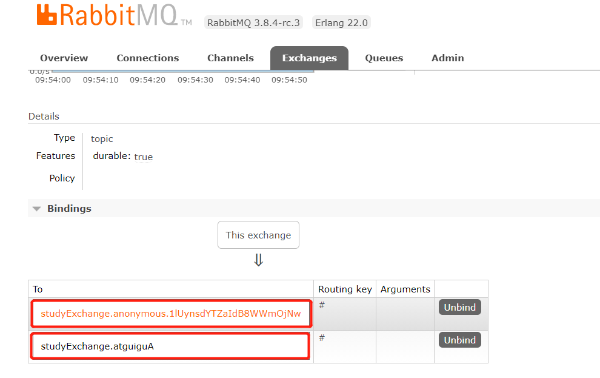


要分组的话只要在消费端通过group配置以下就可以了:

```properties
spring:
  application:
    name: cloud-stream-consumer
  cloud:
    stream:
      binders: # 在此处配置要绑定的rabbitmq的服务信息；
        defaultRabbit: # 表示定义的名称，用于于binding整合
          type: rabbit # 消息组件类型
          environment: # 设置rabbitmq的相关的环境配置
            spring:
              rabbitmq:
                host: localhost
                port: 5672
                username: guest
                password: guest
      bindings: # 服务的整合处理
        input: # 这个名字是一个通道的名称
          destination: studyExchange # 表示要使用的Exchange名称定义
          content-type: application/json # 设置消息类型，本次为对象json，如果是文本则设置“text/plain”
          binder: defaultRabbit # 设置要绑定的消息服务的具体设置
          group: atguiguA
```


---


#### 消息的持久化:

   **==消息的持久化就是一定要对消费者进行分组, 否则当消费者宕机重启之后, 消费者就拿不到队列里面的消息, 而分组是可以拿到的==**


***


## Sleuth

什么是Sleuth, 能用来干什么, 解决了什么问题?

在微服务框架中, 一个由客户端发起的请求在后端系统中会经过多个不同的服务节点调用来协同最后产生的请求结果, 每一个前段请求都会形成一条复杂的**==分布式服务调用链路==**, 链路中的任何一环出现高延时或错误都会引起整个请求最后的失败. 所以Sleuth解决的是链路跟踪.

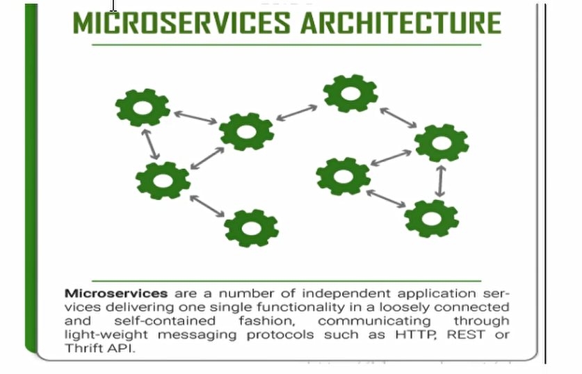


**==Sleuth负责链路的跟踪, zipkin负责链路的展现==**

zipkin的jar包自行下载, 下载完成之后直接java -jar执行:

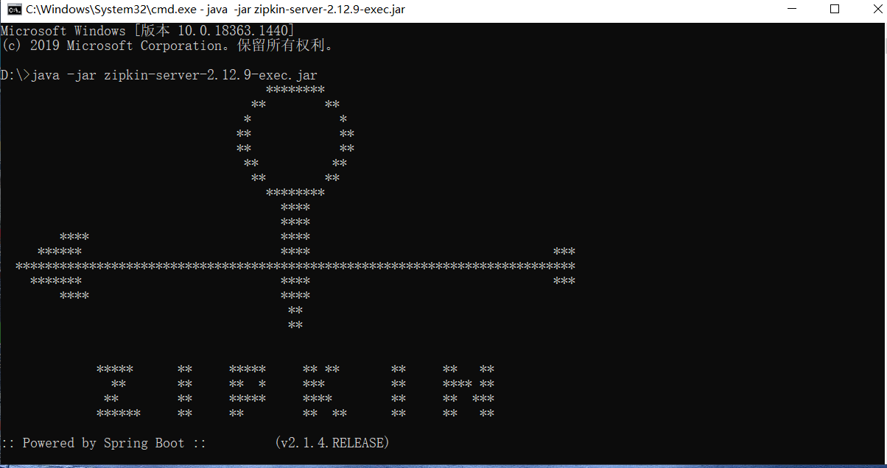

zipkin启动之后可以直接在浏览器进行查看:

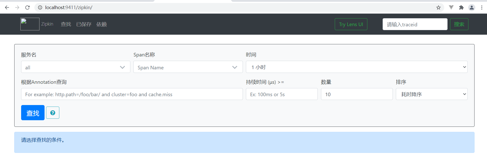

完整的调用链路如图所示:

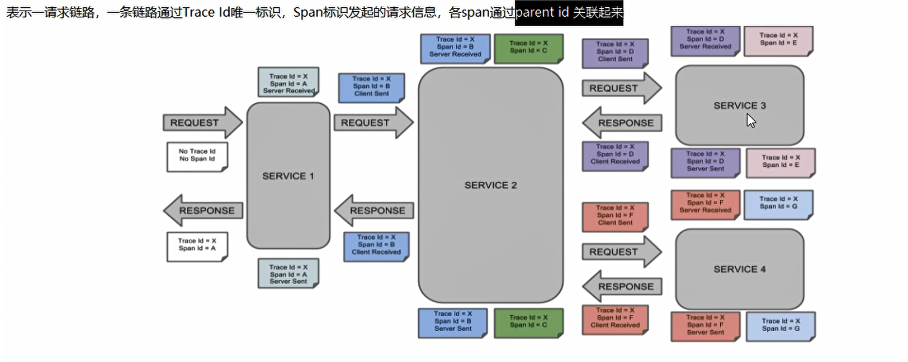

调用链路简化图如图所示(**==每个节点都有spanId和parentId, spanId是节点的唯一标识==**):

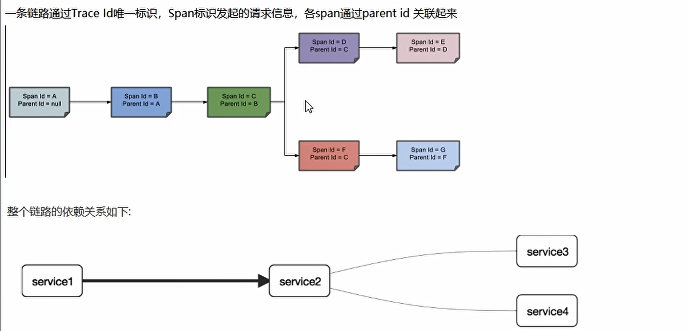


---


### 怎么玩?

**==要跟踪哪个微服务节点就在哪个节点上进行配置就行了==**

1. 添加依赖

```xml
  <!--包含了sleuth+zipkin-->
        <dependency>
            <groupId>org.springframework.cloud</groupId>
            <artifactId>spring-cloud-starter-zipkin</artifactId>
        </dependency>
```

2. 编写配置文件

```properties
spring:
  zipkin:
    base-url: http://localhost:9411 #填写我们的zipkin的地址
    sleuth:
      sampler:
      #采样率值介于0到1之间, 1则表示全部采样, 一般用0.5就够了
      probability: 1
```

然后还要运行我们的zipkin才能够监控到我们的调用链路, 使用java -jar运行(详细请看上述教程)

当我们进行服务调用的时候就可以在我们的zipkin中看到我们的调用链路了:

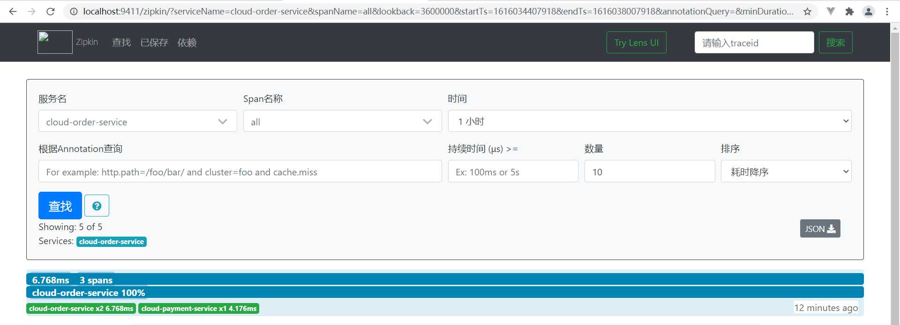

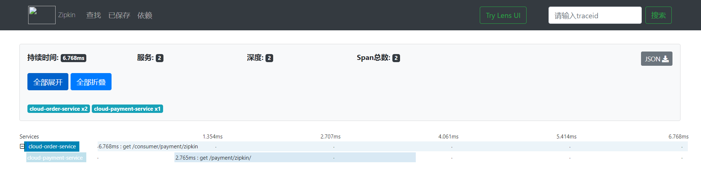

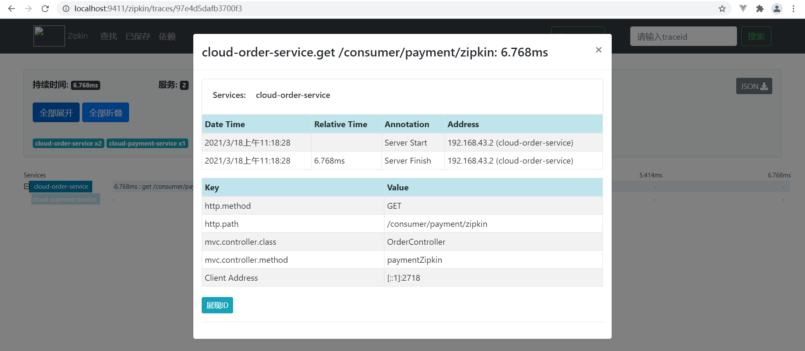

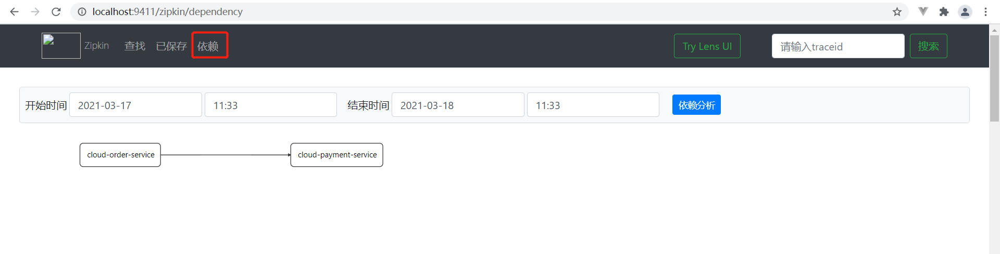

